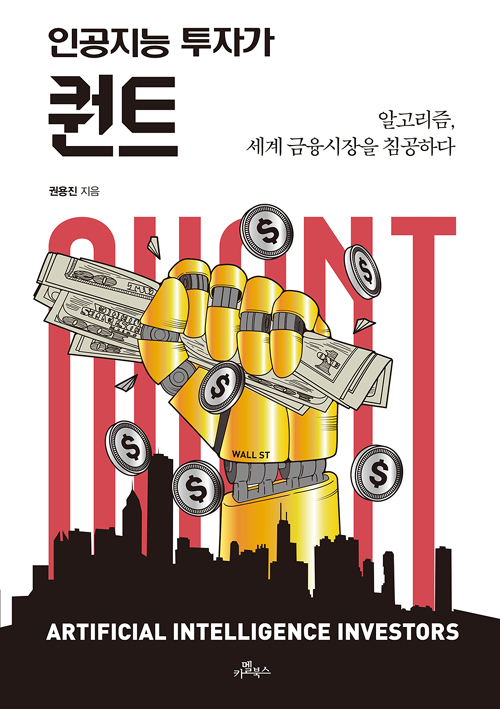

## 제프 베조스는 90년대에 퀀트였다?

“아마존, 세상의 모든 것을 팝니다.”를 읽었을때 흥미로웠던건 중 하나가 제프 베조스가 프린스턴 대학 졸업 후 퀀트 헤지펀드 회사 D.E. 쇼 앤 컴퍼니에서 컴퓨터 기술을 활용한 회사에서 일을 하다가 나와서 아마존 창업한 초기 스토리를 읽었었다.
90년대 초에 퀀트, 그것도 컴퓨터 자원과 알고리즘을 활용했다고 하니 제프 베조스의 비범함, 그리고 역시 미국이라는 생각이 들었다.
해당 스토리는 책에서도 한번 더 언급되기도 하는데 지금이 19년, 곧 2020년이라는 걸 생각하면 거의 30년에 가까운 세월동안 이미 미국 월스트리트에서는 인공지능 알고리즘 개발 역사가 있다는 것이다.

퀀트에 대해서는 들어보긴 했지만 그때부터 본격적으로 궁금해지기 시작했다. 나도 인공지능 좀 공부해봤는데.. 도대체 돈을 어떻게 번다는거야?

## 내 얘기

내가 제일 처음 인공지능에 관심을 가지게 된 것이 11년도 Udacity 세바스찬 쓰런 교수의 자율 주행 자동차 강좌 소개 영상이었는데 그것도 벌써 8년이 넘었다. 그 사이에 수학부터 데이터 분석, 머신러닝, 통계학까지 차근차근 공부를 하다보니 공부 그 자체가 너무나도 재밌었지만 머신러닝이나 딥러닝이 만능이 아니라는 것, 오히려 간단한 통계분석과 몇가지 분석 자동화만으로도 충분히 가치를 낼 수 있다는 것도 역으로 많이 깨달았다. 특히 스타트업 서비스를 운영하고 기획하는 입장에서 기술 맹신주의에 빠져 모든 걸 최신 기술에만 의존하기 보다 진정한 고객 가치가 발생하는 부분을 파고들어 밑바닥부터 작은 것부터 만들어가는게 중요하다는 것을 많이 느꼈다. 그게 중요하다면 처음에는 손으로라도 해야하는 것이다. 자동화나 기술 도입은 그 가치가 충분히 입증되거나 데이터가 있다면 그 다음에 해도 충분하다.

(자기가 정말 딥러닝 연구만 하고 싶고 기술 자체가 좋다고 하는 분들은 수준 높은 IT 대기업 연구팀을 들어가는게 좋을 것이다. [[카카오AI리포트]세상을 바꾸고 싶다면,딥러닝\_김남주](https://brunch.co.kr/@kakao-it/59) 이런 글도 있으니 읽어보고..)

정리하자면 막상 공부를 했는데 내가 하는 프로젝트에서는 많이 활용될 수가 없더라. 데이터도 없을 뿐더러 분석이야 굳이 머신러닝까지 안거쳐도 가공만 잘해도 꽤 괜찮은 고객 만족도를 보여줄 수 있었다. 이걸 어떻게 써먹나 하면서 평소에 고민하다가 관심이 간 것이 바로 퀀트였다.

비트코인 투자로 돈만 날려봤지 주식은 해본적도 없고 관심을 가진 적도 없었다. 한참 돈이 궁해서 “머니”라는 책을 읽었었는데 최근에야 ETF 투자, 채권, 인덱스 펀드 등의 단어를 알게 되었다. (사실 아직도 잘 모른다.)

수리통계학에서 조금 심화된게 계량 경제학인데 나름 통계학을 공부하기도 했고 관심도 많았는데 그런 지식을 활용해서 나만의 돈 버는 봇을 만든다? 그리고 최근에는 머신러닝까지 활용하고 심지어는 강화학습까지? 솔깃할 수 밖에 없는 이야기였다.

하지만 국내 기술 서적들이 대부분 그렇듯이 주식 거래소 종목 크롤링하는 정도로 퀀트 개발서적이라고 떡하니 출판된게 대부분이라 일도 바쁘고 해서 잠깐 관심의 저편으로 넘어갔었다.

그러다가 발견한게 바로 이 책 **“인공지능 투자가 퀀트: 알고리즘, 세계 금융시장을 침공하다”** 이다.

## 책 추천

이 책은 모든 분들께 추천한다. 인공지능에 관심이 없어도 주식 트레이딩이나 금융에 관심 없어도 그냥 재밌다. 빅쇼트 같은 영화를 보고 좋아했다면 더더욱 취향에 맞는 책이 될 것이다.

퀀트가 생기기 시작한 역사(그 시작은 도박과 확률 게임이었다)부터 한국인 유학생인 저자 본인이 처음 투자 은행 퀀트팀에 입사하여 퇴사할때까지 스토리를 굉장히 몰입감있게 다이나믹하게 풀어놨다. 아마 대부분 리뷰를 쓰신 독자분들의 공통된 의견이 이 부분에서 정말 시간 가는 줄 모르고 책을 읽었다고 하더라.

저자는 인턴/신입 시절부터 퀀트 개발자 역할을 맡아서 트레이딩 속도를 최적화하고 시뮬레이션 시스템을 만들었다가 월스트리트의 폭풍같은 사건들이 지나가면서 직접 본인만의 알고리즘을 만들고 그걸로 성과를 내는 과정까지 정말 경험하지 않았다면 알 수 없는 디테일한 이야기와 월스트리트 사내 정치, 산업 스파이 이야기까지, 정말 2장은 월스트리트를 배경(사내 정치 스릴러)으로한 개인의 성장 스토리를 담아내어 계속 다음편이 궁금해지는 미드를 보는 것 같았다.

하지만 이 책의 역할은 무엇보다 ‘학구열 뽐뿌’에 있다. 다시 수학책을 펼치고 식었던 학구열을 불태워주게 한다.
'와 이렇게 똑똑한 사람들이 이렇게 치열하게 연구하고 고민하고 생활하고 있구나.’ 하면서 그래도 나름 공부했다고 나이브하게 생각한 나에게 많은 자극을 주었다.

특히, 처음에 투자은행 신입 인턴 면접을 보는 과정을 상세하게 써놓았는데 그것이 너무 좋았다. 단순 암기 문제부터 통계, 알고리즘 등의 여러가지 면접을 보는 과정들과 질문들을 상세하게 써놓은게 너무 좋았다.

(1단계 면접이 단순히 두자리 수 곱셈 암산부터 기대값 구하는 문제를 굉장히 빠른 시간 안에 즉각적으로 대답해야 한다는 것이 인상적이었다. 그리고 2단계, 3단계에서 수학, 통계, 알고리즘에 대한 상세한 질문들도 나열되어있으니 이것이 궁금하면 책을 꼭 읽어보자.)

그 과정에서 수학이나 통계를 정규대학에서 아카데미컬하게 훈련을 받은 것이 또는 혼자 공부하더라도 개념의 이해만 대충되면 넘어갈게 아니라 열심히 문제풀이하고 어려운 문제 풀고 어떨때는 기계적으로 문제 풀이 훈련을 할 필요가 있다는 것을 다시 한번 느끼기도 했다.

정말 재밌게 읽은 책이고 동기부여가 되어 이번을 계기로 시간날때마다 관련 공부도 계속해보려고 한다.
(이 책을 읽던 중 해당 저자가 [퀀트 실습 교육](https://avengerschool.com/courses/quant)을 한다고 해서 바로 선착순 신청까지 했다.)

(저자의 [브런치](https://brunch.co.kr/@nsung)가 원래 유명했다고 하니 여기 글도 읽어보려고 한다.)

그리고 최근에는 국내 로보어드바이저 스타트업들 AIM, Fint, 헤이비트 등의 자료들도 찾아보고 소액으로 투자하면서 봇이 어떻게 트레이딩을 하는지도 보고 있다.

또 재밌는 걸 발견했는데 이런 저런 자료를 찾아보다가 한때 수험생 커뮤니티로 이름을 날렸던 오르비라는 곳에서 Sindbad 라는 강화학습 AI 를 이용해서 주식 투자로 수익을 내고 있다고 한다.

(이 책의 마지막에도 강화학습을 적용해보려고 하는 회사에 대한 이야기였는데 국내에도 이런 곳이 있었다.)

- [오르비는 무엇을 하는 회사인가](https://orbi.kr/00013839609)
- [오르비 AI-based trading bot Sindbad 수익률 업데이트 (1/9)](https://orbi.kr/00014196521)

## 마무리하며

최근에 고등학교 친구 셋과 연말 모임을 가졌다. 이제 다들 직장에서도 안정화가 되었고 한 명은 벌써 애기까지 있는 애아빠다. 30을 갓넘은 아재들이 모이니까 정말 부동산, 주식같은 이야기를 하고 있더라. 하다보니 퀀트 이야기도 하게 되었고.. 재작년에 모였을때 비트코인 투자 이야기로 밤샘을 했으니 어찌보면 공통된 이야기인 것 같기도 하다. 바로 돈 이야기.

결론이 재미나게 났는데 돈 없다고 한탄하지 말고 어쨋든 내 공부해서 내 앞길 스스로 살펴가자, 어차피 인생에 정답은 없으니 항상 겸손하게 배우자, 우리처럼 없는 놈들은 공부라도 해야된다 라는 얘기로 결론이 났다. (그 후에 내가 이 책을 카톡방에 추천을 해주었다.)

지금은 프론트 개발에 내가 업무 집중도를 높여야하는 시기이지만 조금 더 시간을 내서 관련 공부를 열심히 해볼까한다. 결국 데이터를 수집해서 분석하고 패턴을 발견하고 더 좋은 결과를 내기 위해 승률 높은 기회에 투자하는 것은 내가 무언가 구매를 할때, 회사에서 마케팅을 할때, 운동을 할때 등등 어쩌면 데이터 분석을 통해서 얻으려는 본질은 모두 똑같다는 생각이다.

통계학이 기초가 되어 다양한 분야에 적용가능하듯, 그것에서 조금 더 나간 데이터 분석, 또는 이러한 퀀트 분야의 공부가 꼭 그 분야에만 한정된 것이 아니라는 것이다.

어쨋든 공부하면 내 것으로 남는 거니까.

## 밑줄 친 구절

> 전부 다 통계대로 움직이는 것은 아니었지만 짧은 시간 동안 벌어진 틈만 탐지해 거래했기 때문에 일단 벌어진 틈을 찾기만 하면 확실한 수익으로 돌아왔다. 그들은 이러한 전략을 통계적 차익거래(Statistical Arbitrage)라고 부르기 시작했다.

> ‘모든 주식은 무작위이고 절대로 예측할 수 없다’라는 기존 경제학자들의 통념을 뒤집고 ‘주식은 잠깐의 정보 차이로 틈이 생기고 이를 찾으면 돈을 벌 수 있다’라는 혁명적인 시각을 보여준 것이 더더욱 대단

> 인공지능에 사용된 가장 대표적인 기술은 히든 마코프 모델(Hidden Markov Model)이라는 것이었다.

> 이제 시장에서 활동하는 퀀트는 몹시 다양해져 하나로 정의하기도 어려워졌다. 기업의 수익이나 브랜드 가치를 수치화해서 일반적 투자를 하는 퀀트, 에드 소프나 피셔 블랙처럼 평가가 어긋난 파생상품을 거래해서 돈을 버는 퀀트, 뱀버거처럼 다른 주식과의 관계를 파악하는 인공지능을 이용해 거래하는 퀀트, 영향을 주는 요인 분석을 하는 피터 멀러 같은 퀀트, 패턴 인식 기술과 머신러닝을 도입한 사이먼스 같은 퀀트 그리고 시장 충격을 찾아 극초고속 컴퓨터로 돈을 버는 알고 트레이더까지. 이들은 서로의 방식대로 작동하는 인공지능을 가지고 시장에서 돈을 벌기 위해 전쟁을 하기 시작했다. 당연히 이를 혼합한 퀀트도 탄생했고 다른 알고리즘의 행동 양식만 알아내서 그대로 따라하거나 반대 거래로 공격하는 알고리즘 헌터도 생겨났다.

> 샤프 지수는 ‘1의 위험을 감당했을 때 얼마나 많은 수익을 낼 수 있는가’를 이야기한다

> 데이터 분석에서 중요시하는 부분 중 하나가 시각화다. 수치로 있을 때는 잘 몰랐던 상관관계나 핵심 추세도 시각화를 하면 눈에 보일 수 있다.

> “거대한 데이터가 있고, 연구 플랫폼이 있고, 시뮬레이션 시스템이 있다. 팀의 수익률에 연연해 하지 마라. 너의 알고리즘을 만들어라. 어차피 밖으로 나가도 퀀트가 믿을 건 이전 회사의 수익률도 아니고 인맥도 아니다. 오직 너의 알고리즘뿐이다.”

> 통계 지식 같은 경우 최소한 선형 회귀나 확률론 정도는 확실히 익혀두어야 하고 데이터에 대한 통계적 상태를 추출할 줄 알아야 한다. 데스크 퀀트처럼 파생상품 설계를 직접 하는 경우에는 푸리에 변환, 편미분 방정식, 실해석학 등 고급 수학을 요구하지만 퀀트 트레이더처럼 시계열이 더 중요한 직종 같은 경우에는 고급 수학 지식을 많이 쓰진 않는다. 오히려 데이터 분석과 관련된 지식이 더 중요한 편이다. 물론 수학 지식을 적용시켜서 자신만의 방법을 구축하는 수학 고수 퀀트 트레이더도 굉장히 많다. 다만 필수가 아니라는 것이다.

> 데이터를 읽고 의미 있는 결과로 바꾸는 것이 워드 프로세서 능력만큼 대중화되고 필수적인 능력이 될 것이다. 인공지능의 시대에서 무조건 인공지능이 모든 것을 지배하는 게 아니다. 인공지능이라는 것은 학습과 데이터를 기반으로 하며 이 모든 것들은 데이터 과학자가 어떤 선생님이 되냐에 따라서 천차만별인 결과를 가져온다.

## 책 속의 추천 책

- 《프로야구 명감독이 주식 투자를 한다면》
- 《문병로 교수의 메트릭 스튜디오》
