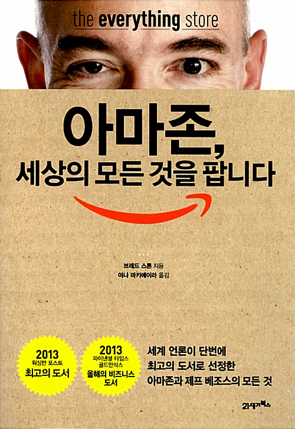

## 제프이즘(Jeffism)

> “우리를 남다르게 만드는 것이 무엇인지 궁금하시다면 그 진실은 바로 이것입니다. 우리는 진정 고객 중심적이고, 진정 이 사업을 장기적으로 바라보고 있으며, 진정 창조를 즐깁니다. 하지만 대부분의 회사는 그렇지 않습니다. 그들은 고객이 아닌 경쟁자에 집중합니다. 그들은 2~3년 안에 수익을 올릴 수 있는 것에 투자하기를 원합니다. 그래서 2~3년 이내에 잘 되지 않는다 싶으면 다른 사업 거리를 찾아나서는 거죠. 또 대부분의 회사는 창조하기보다 근소한 차이로 창조자를 따라가기를 선호합니다. 왜냐하면 그 편이 더 안전하니까요. 이것이 바로 우리가 남다른 이유입니다. 이 세 가지 모두에 역점을 두는 회사는 거의 없거든요. 이것이 아마존의 진실이죠.”

---

최근에 즐겨보는 영화 유튜버 '기묘한 케이지'님의 영상 중에 현재 전세계 공식 최고 부자 중 한 사람인 제프 베조스의 이야기를 담긴 [유튜브 영상](https://youtu.be/oe1RDNoTUHk)을 보았다. 해당 영상은 베조스의 우주 사업 '블루 오리진'에 대한 이야기였는데 미국 최대 온라인 마켓플레이스인 아마존을 운영하는 CEO가 왠 우주? 라는 의문이 들었었다.
하지만 해당 책을 읽으면서 그가 어릴적에 스타트렉의 덕후 기질이 다분히 있었다는 것을 알고는 이해가 되었다.

제프 베조스는 굉장히 독선적이고 성미가 괴팍한 흔히 우리가 생각하는 스티브 잡스 같은 경영자 유형이다. 하지만 그의 그런 성미가 진정한 '고객 중심'에 향했다는 것이 단순히 독선적이고 괴팍한 것이 아닌 비범함과 미래를 바라보는 통찰로 표현될 수 있는 것 같다.
책은 크게 세 파트로 나뉘어져 있다. 아마존의 초창기와 제프 베조스가 아마존을 시작하기 전까지의 삶, 그리고 현재의 모습이 되기 까지 아마존의 모습이다.

한국에서는 아마존을 대부분 잘 모르지만 IT 개발자라면 모두 AWS를 이용해서 서비스를 배포하거나 공부해본 경험이 있을 것이다. AWS가 어떻게 만들어졌는지도 어떻게 시작했는지도 상세하게 나오기 때문에 관심이 있다면 흥미롭게 읽을 수 있을 것이다.

책을 읽으며 제프 베조스는 어릴적부터 대학을 졸업할때까지 공부를 굉장히 잘하는 엘리트라는 것을 알게 되었다. 그리고 그것이 경쟁을 두려워하지 않는 대담함과 자신감의 결과이며 그것이 현재의 아마존에도 계속해서 강력하게 영향을 미치고 있다는 것, 하지만 그도 인간이고 많은 실수를 했고 경영적 판단에서 잘못된 판단도 내리고 그런 성미 때문에 그가 분명 잃은 것도 있었다.

아마존의 역사를 보면서 사업을 하는데 있어서 얻을 수 있는 많은 통찰을 얻었다. 그리고 장기적인 비전을 가지고 진정으로 고객 중심으로 사고하는 것이 어떠한 것인지도 알게 되었다. 물론 아는 것과 실천하는 건 다르지만..

요즈음 회사를 운영하면서 너무 많은 어려움에 직면하고 있다.
하지만 그 중에서도 가장 날 괴롭히는 생각은 도대체 고객이 원하는게 무엇인지 시간이 지날수록 더 모르겠다는 것이다. 사실 처음에 시작했을때는 그걸 안다고 생각했는데 그리고 어느정도 그들을 안다고 생각했는데 의외의 모습에 당황하고 헤매고 허우적대다보니 지금은 오히려 더 모르겠다는 것이다.

책 한권에 현 상황을 해결할 해결책을 바로 얻지는 못하겠지만 아마존의 역사와 그들의 삽질, 제프 베조스의 제프이즘을 느끼며 나름의 아이디어를 얻기는 했다. 또한, `장기적인 비전과 진정으로 고객 중심적인 사고`를 하는 것은 쉽지는 않겠지만 계속 내가 앞으로 견지해야할 태도일 것이다.

그리고 항상 책을 많이 읽고 더 열심히 공부하는 자세를 가지자. 우리나라에서 공부 머리와 사업 머리를 구분하는 고정관념이 있는데 최근에 잠깐 보았던 다큐멘터리 빌게이츠도 스티브 잡스나 이 책의 제프 베조스도 소싯적(?) 어마어마한 공부 머리들이었고 엘리트였으며 사업을 하는 지금 이 순간까지도 항상 공부하고 많은 책을 읽고 있다는 것을 새삼 책을 통해 영상을 통해 다시 알게되니 더 노력해야겠다는 생각이 들었다.

책을 읽으면서 쿠팡과 티몬의 차이점도 알게 되었고, 왜 손정의가 알리바바와 쿠팡에 투자했는지도 아마존을 공부하면서 이해하게 된 것 같다.

온라인 마켓플레이스의 구조와 혁신, 그리고 기업가 정신에 관심이 있다면 이 책을 추천한다. 그리고 제프 베조스가 궁금한 사람들도 꼭 읽어보길 바란다. 그의 어린 시절, 어머니와 외할아버지와의 에피소드는 많은 걸 느끼게 해준다.

> “직원 여러분은 요즘 매일 아침 눈을 뜨면 걱정이 되고 불안할 겁니다. 하지만 경쟁자를 걱정하지 마세요. 어차피 우리한테 돈 한 푼 주지 않은 사람들입니다. 우리는 고객을 걱정하고 우리가 할 일에 집중합시다.”
