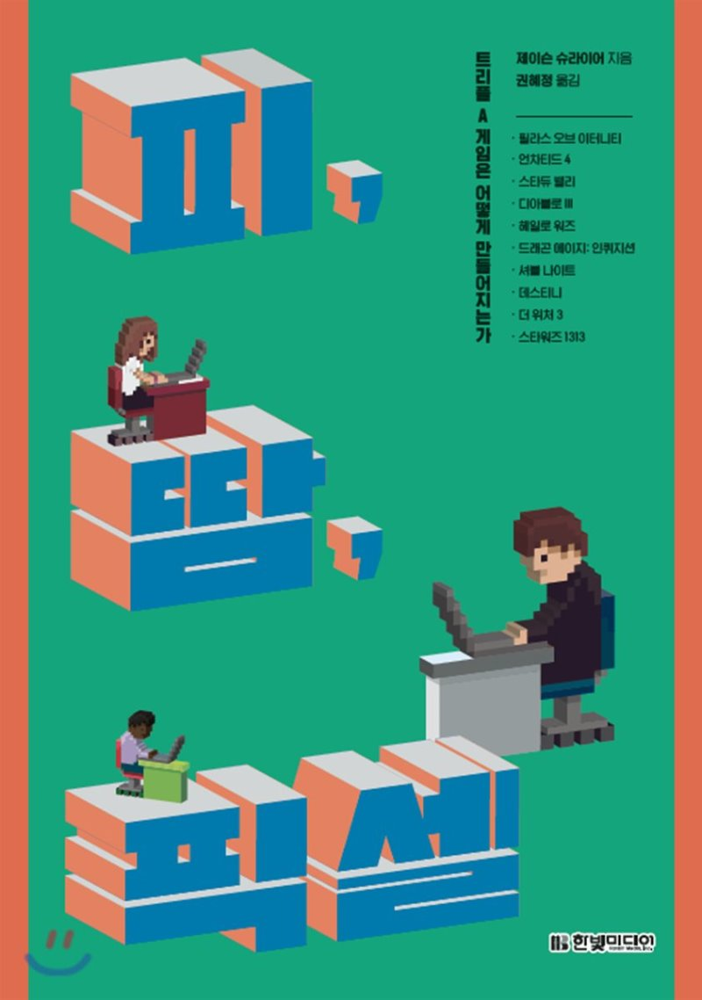

## 이 땅에 모든 겜돌이, 겜순이 그리고 모든 IT 업계 종사자들을 위한 위대한 스토리

이 책을 한마디로 요약하면 **게임을 만드는 다양한 회사들의 게임 개발 뒷이야기** 정도가 될 것 같다.

개인적으로 나는 겜돌이로 게임을 엄청나게 잘하는 편은 아니지만 어릴 때부터 지금까지 많은 게임을 했고 즐겼다. 특히, 이 책에 나오는 게임 중 너티 독의 '언차티드 4'는 정말 몰입해서 엔딩을 봤던 기억이 있으며 너티 독의 이전 게임인 '라스트 오브 어스'는 엔딩을 두 번이나 보았다. (시간이 없어 언차티드 4 확장판은 아직 초반부 플레이만 하고 봉인 중이다. 엄청난 분량을 자랑하는 '위쳐 3' 역시 재미나게 한 게임이지만 역시 엔딩을 보지는 못했고 '디아블로3'은 많이 즐기지는 못했지만 내가 사랑하는 블리자드의 스토리 텔링에 빠져 디아블로에 나오는 악마들의 관계까지 줄줄이 꿰고 있었던 적도 있었다. 스타듀 밸리, 셔블 나이트 같은 게임은 유튜버들이 스트리밍하는 걸 많이 시청했던 기억이 있다.

이미 책에서 언급하는 게임 반을 알거나 플레이해 보았고 반절 이상은 모두 이름은 들어본 게임들이라 게임톡에서 읽었던 책 내용의 일부를 발췌한 <a href="http://m.gametoc.hankyung.com/news/articleView.html?idxno=49131" target="_blank">이 기사</a>를 읽고 언젠가는 꼭 읽어봐야지, 다짐하다가 어느 날 서점에 들르자마자 바로 책을 샀다. (혹시 어떤 책인지 궁금하신 분들은 이 글보다 저 기사에 나온 책 내용을 한 편 읽어보고 책을 구매하는 것도 나쁘지 않다)

사실 책은 게임 개발을 하는 사람들의 이야기지만 나는 겜돌이이기 이전에 IT 스타트업에서 기획자로 개발자로 일하는 한 사람으로 정말 몰입해서 읽게 된 것 같다.

책에 나오는 수많은 게임 개발자들의 '크런치 모드'에 차마 웃으며 들을 수 없는 처절하고 처절한 게임 개발기를 듣다 보니 가끔은 마음이 아프기도 그들의 열정에 가슴이 뛰기도 했다. 그리고 나도 그렇게 일해본 경험이 있으니 그들과 똑같지는 않지만 그들의 감정이 (기쁠 때나 슬플 때나) 공감이 갔다.

책에서는 게임만 다양한 것이 아니라 각 게임 개발의 '스테이지'도 다르다. 똑같은 대형 게임 개발사의 성공담을 다룬 대표적인 두 게임 '언차티드 4'와 '위쳐 3'는 비슷한 얘기인 것 같지만 언차티드를 개발한 너티 독은 이미 라오어로 성공한 '미국' 회사였고 '위쳐3'를 개발한 'CD 프로젝트 RED'는 게임 개발자가 대부분 어린 시절을 동유럽의 공산주의에서 자란 '폴란드' 회사였다. (이들의 '반공' 정신은 정말 인상적이었다.)

특히, '스타듀 밸리'의 개발 스토리는 정말 눈물 나는 과정이었다. 비슷한 규모의 '셔블 나이트'는 그래도 같이하는 팀원이 있었는데 '스타듀 밸리'는 말 그대로 1인 개발자가 거의 5년 가까운 시간을 골방(?)에서 사운드, 그래픽, 시나리오, 프로그래밍 모두를 혼자서 개발하며 결국 마지막에 게임이 대히트를 치는 스토리는 정말 왠만한 실화 영화 스토리로도 손색이 없는 그런 과정이었다.

'디아블로3'는 게임은, 아니 모든 제품은 출시가 아니라 출시 이후라는 걸 보여준 대표적인 게임 개발 스토리였다. 지금은 사라진 블리자드의 겜돌이 정신으로 초반의 무수한 버그, 밸런스 문제, 경매장 문제 등을 유저와의 적극적인 커뮤니케이션을 하면서 한번 출시된 게임을 그 뒤 3년 동안 계속해서 업데이트하며 좋은 게임으로 거듭나는 모습은 현실적이며 앞의 성공담처럼 진한 감동은 없었지만 느끼는 바가 많았던 에피소드였다.

그리고 마지막 '루카스아츠'는 힘차게 시작하고 언론의 찬사까지 받은 기대작 게임 '스타워즈 1313'이 디즈니가 '루카스필름, 루카스아츠'를 인수하며 모든 팀원이 이 게임에 올인했지만 어쩔수없는 어른의 사정으로 프로젝트가 그렇게 무산되어버린 슬프고도 가슴 아픈 스토리였다.

책이 처절한 얘기도 정말 아름답게 포장한 건 모르겠지만 '크런치 모드'에 시달려 갈려나가는 개발자들(디자이너, 개발자, 기획자 모두 포함)이 처절했지만, 그 과정은 정말 아름다워 보였다. 최소한 그들은 그들이 하고 싶은 것, 만들고 싶은 게임에 모든 걸 쏟아붓는다는 느낌이었다. 그리고 모든 개발 과정은 예측할 수 없다는 것에 안도(?)했고 남들이 아닌 자기 자신을 이기려들 때만이 진정으로 승리하고 남들도 인정하는 성공을 맛볼 수 있다는 것도 다시금 알게 되었다.

제품 그 자체에 퀄리티에 더 집중하자. 그리고 조금 늦어진다고 해도 내가 세운 그 기준을 포기하지 말자. 책에서 나온 게임개발사들의 그런 달콤한 성공의 순간이 나에게 올지는 모르겠지만 그렇게 조금씩 열정을 다해 노력하면 최소한 나 스스로는 만족할만한 결과물이 나오지는 않을까?

게임이든 웹 서비스, 앱 등 IT 업계에 종사하며 오늘 하루도 '크런치' 하며 스스로 또는 회사에 의해 갈려나 가고 있을 수많은 개발자들(디자이너, 개발자, 기획자 모두 , 그리고 나처럼 어디에 한 번 빠지면 그 배경까지 속속들이 알고 싶어 하는 스토리를 사랑하는 모든 겜돌겜순이들께 이 책을 추천한다.

## Update

### 2019-11-14

Dragon Age를 성공시킨 바이오웨어의 경우 뭔가 엄청난 후속작일 것 같았던 ANTHEM을 출시했고 망했다. EA 배급사의 문제인지 바이오웨어의 내부 사정인지는 모르겠지만.. 그 고난과 역경을 겪더라도 역시 내부 사정(배급사와의 관계, 사내 정치, 기존 개발진들의 이직 등)에 의해 그런 스탯들이 초기화되고 실패하는 경우도 많은 것 같다.

Blizzard는 작년부터 올해 하반기 블리즈컨 직전까지 "여러분들 스마트폰 없어요?"라는 스마트폰 시대가 끝나기 전까진 회자될 명대사(라 쓰고 망언이라 읽는)를 남기고 홍콩 프로게이머 선수 중징계 논란으로 블리자드의 정치적 올바름(PC)의 기준은 시진핑(차이나 머니)이라는 기사가 도배될 정도로 위기를 겪었다. 올해 2019 블리즈컨 또한 장례식이라고 불렸는데 대표가 첫 인사말로 사과까지 하면서 디아블로4, 오버워치2 등 신작을 발표함으로써 분위기 반전을 노리면서 역시 겜돌, 겜순이들에겐 어쨋든 게임만 재밌으면 된다라는 불변의 법칙 덕분인지 나름 반전에 성공을 거둔 것처럼 보인다. 물론 지켜봐야겠지

스타듀밸리는 개인적으로 아이패드 프로를 바꾸고 처음으로 구매한 유료 게임이자 정말 재밌게 플레이했는데 뭔가 반복적인 노가다와 힐링이 아닌 목표 달성을 위한 게임이 되는 순간, 과감히 앱을 삭제했다. 나중에 모바일 버전에서 멀티플레이가 지원되면 한번 해볼까..

위쳐3를 개발한 'CD 프로젝트 RED'는 사이버펑크 2077 트레일러를 발표하면서 최고의 기대감을 모으고 있다. 나 또한 엔딩을 못봐도 이 게임을 구매할 생각이다. 1인칭이라는게 좀 걸리는데 뭐 몰입감을 위해서라니까 믿고 기다려본다. 이 게임에 조금이라도 관심이 있다면 <a href="http://www.inven.co.kr/webzine/news/?news=221878&sclass=17" target="_blank">이 기사</a>를 읽어보자.

아무 걱정없이 하루 날밤까면서 즐기는 게임은 정말 즐겁다. 최근에도 간간히 이런저런 게임을 해왔는데 게임에서도 뭔가 배울게 있지 않을까. 관련 리뷰도 작성해보면 좋을 것 같다.
