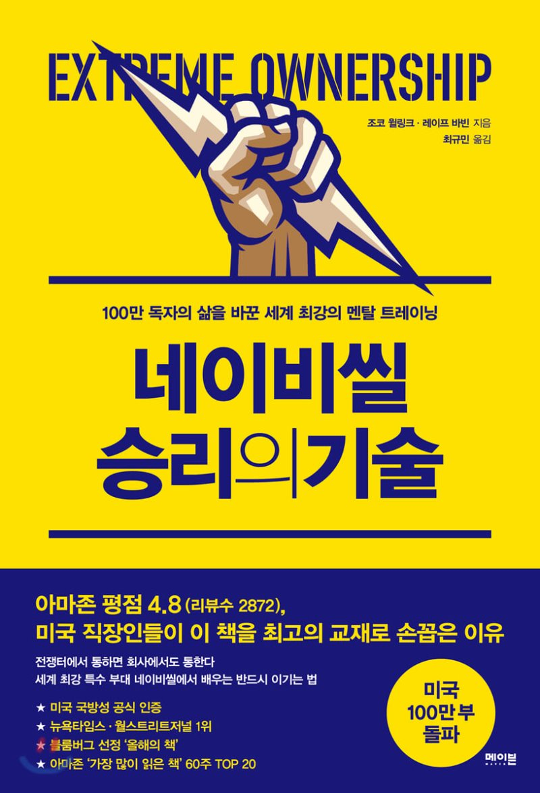

## 극한의 오너십 : 미국 네이비 씰이 리드하고 이기는 방법

위 제목이 원제인데, 극한의 오너십(Extreme Ownership)이라고 말하는 책의 제목이 이 책을 관통하는 모든 주제이다. 모든 일의 책임을 나에게 두고 어떻게 해결할지 모색하는 극한의 오너십은 우리에게 리더십은 무엇인가 고민하게 하고 우리는 과연 잘하고 있는가 강하게 질문을 던진다.

## 군대에서 리더십을 배운다고?

네이비씰은 미국의 해군특수부대이다. 우리나라에 가장 비슷한 부대가 아마 UDT/SEAL 해군 특수부대일 건데, 참고로 해병대(참고로 해병대는 정규군이다. 특수부대가 아님.)에서 군복무를 하던 시절, 우리나라 UDT/SEAL 대원들과 훈련을 받은 기억이 있다. 나름 깡 좀 있고 몸 좀 쓴다는 해병대원들을 모두 압살(?)해버리고 항상 체력 경쟁에서 1등을 해먹는 UDT 대원들을 보며 우리 해병대원들은 존경심과 더불어 두려움의 존재였었다. 그런 부대의 모티브가 된 미군 특수부대가 말하는 리더십이란 무엇일까? 도대체 특수부대는 어떻게 훈련받고 어떻게 작전을 수행할까? 그런 궁금증과 더불어 리더의 자리에 있는 많은 분들이 추천해주고 있어서 망설임 없이 책을 선택했다.

그리고 기대를 저버리지 않고 네이비씰은 우리나라에서 흔히 생각하는 군대의 스테레오 타입을 한참 벗어나 있었다. 생각해보면 이라크 한복판에서 목숨이 오가는 작전을 수행해야하는데 막가파(?)식으로 진행하면 아마 작전에 실패하고 죽고 말 것이다. 까라면 까는게 군대라고 생각하는 분들이 많겠지만 네이비씰은 그러한 모습과는 상당히 거리감이 있다. 납득되지 않은 명령은 상관에게 설명을 요구하기도 하고 팀원 한명 한명에게 작전 수행의 이유를 최대한 설득하기 위해 최선을 다한다. 목숨이 오가는 전장인 만큼 엄격한 규율을 가지고 있지만 절대 그것이 조직을 경직시키지는 않고 오히려 활발한 소통과 높은 수행 능력으로 나타난다. 장교 출신인 두 저자는 왠만한 회사 업무에 뒤지지 않는 업무량의 PPT를 만들기도 하고 어쩌면 부끄러울수도 있는 본인들의 실수와 잘못된 판단, 리더로써 내린 다양한 결정과 경험들을 최대한 생생하게 전달해준다.

생각해보니 네이비씰 이야기를 처음 읽은 것은 《최고의 팀은 무엇이 다른가》라는 책이었는데 작전 수행 후 회고하고 개선하고 자유롭게 피드백을 주고 받는 모습은 계급이 있고 규율이 있는 조직이라고는 생각하기 힘든 모습이었다. 스타트업이나 애자일 조직에서나 볼 수 있을법한 모습을 군대에서 볼 수 있다니.

군대는 커녕 작은 조직에서도 팀장이나 대표에게 쉽게 물어보지 못하는 사례를 너무 많이 보았고 팀장이나 대표인 사람들도 그런 직원에게 충분한 설명을 해주기는 커녕 화만 내는 경우가 대부분이었다.

책은 이라크전 당시 작전, 그것에서의 교훈, 그리고 그 교훈에 기반하여 기업들의 문제를 컨설팅해준 사례들로 구성되어 있다. 리더십을 말한다고 해서 꼭 리더 자리에 있는 사람만 볼 책은 아니다. 이제 일을 시작한 신입이나 대학생, 부부, 중간관리자 등 다양한 분들에게 이 책을 추천한다. 어쩌면 다른 사람과 관계가 생기는 모든 곳에서 이 책의 지침들은 유효한 것 같다.

## 내 얘기

일단 책을 읽는 내내 부끄럽고 반성하는 시간이었다. 혼자서 사업을 시작해서 투자도 받고 20명 가까운 팀원들과 함께하다가 다시 혼자가 된 지금, 나의 경험 속 내 리더십은 실패의 연속이었다. 상황을 탓하기도 하고 팀원들을 탓하기도 했다. 그리고 내 리더십이 실패했다고 생각한 순간, 실패한 사실만 있을뿐 그러면 이제 어떻게 해야하지? 라는 답변을 얻지 못했던 것 같다. 항상 책을 읽으며 하는 후회가 바로 이것이다. 그때 이 책을 읽었더라면.

나는 항상 내가 옳다고 생각하지는 않았지만 그나마 내가 바르게 보고 있다고 생각했다. 그리고 팀원들이 내가 바라보는 방향을 쉽게 이해하지 못할때면 답답해하고 그들을 닦달하기도 했던 것 같다. 그리고 결과가 좋지 않으면 내 책임이라고 말하면서도 마음 속 깊이는 팀원들의 능력 부족을 탓하기도 했다. 겸손하지도 못했고 자만했으며 어리석었던 과거의 내 모습이 이 책을 통해 계속해서 마주하게 되었다.

이런 지침서를 읽으면 (또는 자기계발서류) 나는 이래라, 저래라 해봤자 누구나 할 수 있는 얘기 아니야? 직접 이 상황을 겪어보면 너도 쉽지 않을걸? 같은 생각을 하게 되는데 네이비씰과 목숨이 오가는 특수한 전장에서의 경험은 그런 나의 오만함을 깨고 책 내용을 신뢰하는 내용들이었다.

책 하나로 바뀌기는 쉽지 않을 것이다. 사람과의 관계, 리더십은 마치 습관과도 같다고 생각한다. 팀원들을 대하는 태도나 상대방에게 말하는 것을 그저 내 감정대로 행동하는 게 익숙한 사람은 그걸 바꾸기가 쉽지 않다. 나도 한때는 그런 적이 있었고 피드백이랍시고, 상대에게 상처를 준 적도 많다. 분명 그것이 잘못된 것을 아는데도 말이다. 왜 알면서도 바꾸지 못할까? 그것이 습관이 되어있기 때문이다. 그리고 그런 행동을 하지 않는다고 바뀌는 것이 아니다. 생각 자체가 바뀌어야 한다.

책에서 말하는 극한의 오너십을 가지고 진심을 다해 그렇다고 생각하면 모든 행동을 하기 전에 내 감정보다는 해결책을 찾게 된다. 그리고 또 그러한 경험이 반복되면 그것이 다시 습관이 되어 내 삶 전반에 더 좋은 영향을 미치게 될 것이다.

## 극한의 오너십

> 자신의 임무뿐만 아니라 임무에 영향을 미치는 모든 것을 자기 책임이라고 생각한다는 점이다. 이들은 어떤 경우에도 다른 팀원을 비난하지 않는다. 누군가의 실수로 임무가 실패로 돌아가도 남을 탓하지 않는다. 변명도 하지 않는다. 위기나 장애물을 만나면 불평하는 대신 대안을 궁리해 문제를 해결한다. 맡은 일을 성공시키기 위해 자신이 가진 모든 자산, 인간관계, 자원을 총동원한다. 그리고 자존심을 억누르고 임무와 부하들을 앞세운다. 우리는 이를 **‘극한의 오너십’** 이라고 한다.

모든 문제가 발생했을때 그 책임을 스스로에게 있다고 진심으로 생각하는 것은 생각보다 쉽지 않다. 특히 그것이 다른 사람과 협업, 다른 사람과의 관계에서 일어난 일이라면 더더욱 그럴 것이다. 기본적으로 우리는 나의 잘못을 진심으로 인정하기 보다는 남을 탓하기 쉽고 설사 내 잘못이라고 생각해도 그것을 어떻게 해결해야할지 모른다. 극한의 오너십은 세상에서 컨트롤할 수 있는 것은 결국 나 자신 뿐이다라는 것을 인정하고 목표 달성을 위해 쓸데없는 모든 것을 제거하는 것이다. (나의 감정이나 자존심, 불평불만, 변명 등등)

오너십이 주를 이루는 내용이지만 단순한 목표 설정으로 팀을 단결시키고 팀원을 신뢰하고 역할을 위임하는 법, 그리고 삶의 자세(규율이 곧 자유다)에 대해서도 얘기가 나온다. 또한 책 마지막에 리더십을 타고난 사람도 있지만 여기서 말하는 극한의 오너십은 항상 겸손하고 최선을 다하는 자세, 다른 사람을 진심으로 존중하는 자세를 가지고 노력하면 누구나 가질 수 있다는 것이다.

몇 번 더 읽어볼만한 책이다. 어느 조직에서 일하고 있든 지침이 될 만한 책인 것 같다.

꼭 조직의 리더 자리에 있지 않더라도 모든 관계에서 고민하고 있는 분들에게 추천한다. 그리고 누군가에게 리더십을 바라지 말고 나부터 극한의 오너십을 가지고 행동하자. 리더는 그 사람의 자리가 아니라 그 사람의 행동으로 보여주는 것이다. 그렇기에 누구나 리더가 될 수 있다.

## 밑줄 친 구절

> 우리는 ‘하급자가 상급자의 명령을 맹목적으로 따르는 군대의 리더십이 별것 있겠느냐’는 생각도 깨고 싶다. 군대에 몸담은 이들은 영리하고, 창의적이며, 자유롭게 사고하는 개인이다. 그러므로 자신이 싸우는 이유에 대한 신념이 있어야 한다. 지시받은 임무에 대한 믿음, 그리고 자신에게 지시를 내리는 리더에 대한 공감과 신뢰를 가지는 것이 무척 중요하다. 말단 병사를 비롯한 모든 구성원의 의견을 중시하는 네이비씰에서는 더더욱 그렇다.

> 아군 간 교전이 벌어지면 어떤 후보생들은 스스로 책임을 졌지만, 어떤 후보생들은 책임을 부하들에게 떠넘겼다. 나는 책임을 회피하는 나약한 후보생들에게 지휘에 따르는 무거운 책임을 엄혹하게 가르쳤다. 리더는 ‘모든 것’에 진심으로 무한 책임을 지는 사람이기 때문이다.

> 자존심 따위는 버리고 실패의 책임을 받아들이며, 팀의 약한 부분을 쳐 내고, 더 나은 팀을 만들려는 노력을 지속적으로 해야 한다. 그런 리더는 팀의 업적을 자신의 것인 양 우쭐대지 않으며, 오히려 그 영광을 기꺼이 부관이나 팀원들에게 돌린다.

> 뛰어난 성과가 반복되면 습관이 됩니다. 각 조원은 승리하기 위해서는 무엇이 필요한지를 알았고, 실제로 그렇게 했죠. 더 이상 조장의 구체적인 지시가 필요 없는 수준이 된 겁니다. 그 결과 2조는 계속 다른 조보다 좋은 성과를 냈고

> 어떤 조직에서든 조직의 사명과 구성원들의 믿음이 가지런히 정렬되어 있어야 한다. 어느 단계에선가 정렬이 틀어졌다면 반드시 바로잡고 수정해야 한다. 군대나 기업에서 고위 리더들이 일부러 조직을 망치는 결정을 내리지는 않을 것이다. 하지만 하급자들이 특정한 전략적 결정을 이해하지 못하거나 신뢰하지 못하는 경우는 많다. 그러므로 하위 리더들은 상부에 질문을 던지고 구성원들의 반응을 보고해야 한다. 그래야 상부의 전략적 결정이 일선 현장에서 실제로 어떻게 이행되는지 정확히 파악할 수 있다.

> CEO가 자주 하는 착각-직원들은 내 마음을 잘 알고 있다

> 극한의 오너십은 이런 자존심을 경계하고 겸손해질 것을 요구한다. 실수를 인정하고, 책임을 받아들이며, 위기를 극복할 방안을 마련하는 것은 승리를 위한 필수 요소다. 그러나 자존심을 내세우면 리더가 자기 자신과 팀의 성과를 현실적으로 평가하기 어려워진다.

> 모든 계획은 팀의 말단 구성원들도 확실히 이해할 수 있게 설명해야 한다. 팀원 일부가 잘 이해하지 못했을 때 질문할 수 있는 환경을 조성하는 것 또한 매우 중요하다. 리더는 자유로운 의사소통을 장려해야 하며, 팀원 전원이 목표를 완벽하게 이해할 때까지 충분한 시간을 할애해야 한다.

> 전장의 네이비씰 지휘관들은 해야 할 일을 스스로 알아내야 한다. 상급자에게 ‘어떻게 할까요?’라고 묻는 게 아니라 ‘이것을 하겠습니다’라고 말해야 한다. 즉 수동적인 실행자가 아니라 능동적인 지휘관이 되어야 한다는 것이다.

> 100퍼센트 옳은 해결책은 없고, 완벽하게 선명한 그림도 없다. 리더는 이를 겸허히 인정하고 신속하게 결정을 내릴 줄 알아야 한다. 그리고 상황 변화와 새로운 정보에 따라 신속하게 결정을 수정하고 보완할 태세를 갖추어야 한다. 정보 수집과 연구는 중요하다. 하지만 여기에 너무 큰 기대를 걸어서는 안 되며, 이를 핑계로 신속한 의사 결정을 미뤄서도 안 된다.

> 나는 규율이 ‘그저 그런 것’과 ‘특별한 것’의 차이를 만든다는 사실을 노련하고 경험 많은 선배들을 보며 체득했다. 부대 내에서 가장 뛰어나다고 평가받는 선배들은 출근도 가장 먼저 했다. 그들은 가장 훌륭한 전투 기술, 가장 잘 정비된 장비, 가장 뛰어난 사격 솜씨를 가지고 있었다.

> 규율은 자기 통제와 금욕을 요하지만 결국 자유로 연결된다. 아침에 일찍 기상하는 규율이 몸에 배면 더 많은 자유 시간을 보상받는다. 전장에서 늘 헬멧과 방탄조끼를 착용하는 규율을 따르면 장비에 익숙해져 더 자유롭게 움직일 수 있다. 매일 체력을 단련하는 규율을 엄수하면 몸이 더 가볍게 느껴지고 더 빠르게 이동할 수 있다.
