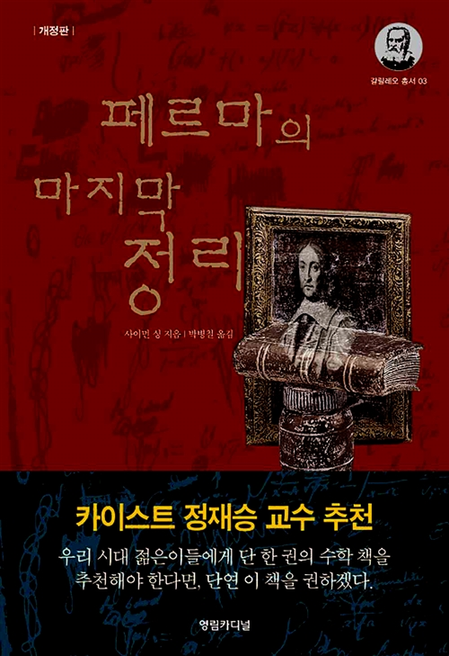

> “Cuius rei demonstrationem mirabilem sane detexi hanc marginis exiguitas non caperet. 나는 경이적인 방법으로 이 정리를 증명했다. 그러나 책의 여백이 너무 좁아 여기에 옮기지는 않겠다.”

---

페르마의 마지막 정리란, $"x^n+y^n=z^n$; n이 3이상의 정수일 때, 이 방정식을 만족하는 정수해 x, y, z는 존재하지 않는다." 이다.
그러나 페르마는 이 정리를 자신의 '아리스메티카'에 코멘트하면서 "나는 경이적인 방법으로 이 정리를 증명했다. 그러나 책의 여백이 너무 좁아 여기에 옮기지는 않겠다." 라는 발칙한(?) 말을 남겨놓았다.

이 정리를 증명하기 위해 수많은 사람들이 도전하였으나 300여년이 넘는 세월동안 그 누구도 증명하지 못하는 난제가 되었다.

사실 '피에르 드 페르마'는 정식 수학자가 아닌 아마추어 수학자로서 실제로 법조인 일을 하면서 취미로 수학을 했다고 한다. 그래서 페르마의 마지막 정리만 보고 그냥 단순히 페르마가 장난을 쳤다고 할 수도 있겠지만 실제로 그는 천재적인 수학 재능으로 여러 정리와 증명을 만들어냈다고 한다. 하지만 공유 정신이 없었던(오픈소스 정신이 없었던..) 그는 대충 자신이 증명했다고 생각하면 그냥 휘갈기고 넘어가는게 대부분이었다고 한다. 법조인으로써 잘 살고 있던 그에게 수학자로서 후학양성이나 지식공유는 아웃오브안중이었을거고.. 실제로 '아리스메티카'는 페르마의 아들에 의해서 완성된 책으로 페르마의 아들도 여기에 관심이 없었다면 페르마의 마지막 정리도 다른 이름이 되었거나 위의 정리가 그렇게까지 사람들에게 관심을 받지 못했을 수도 있다.

어쨋든 이러저러해서 페르마의 마지막 정리가 탄생되어 수많은 사람들이 도전했고 자살, 정신이상, 결투 등의 좋지 않은 사이드 이펙트를 일으키며 300여년이 지나면서 풀리지 않는 문제로 남아있게 되었다.

책에서는 페르마의 이야기부터 정리가 나오게 된 배경(피타고라스의 정리부터..) 여러가지 정수론 이야기, 페르마의 마지막 정리가 증명되기까지 영향을 준 수많은 수학자, 이론 등을 설명하면서 숨가쁘게 진행되다가 드디어 이 책의 주인공인 '앤드루 와일스'에 의해 증명이 되는 그 순간을 극적으로 묘사한다.

수학적인 흥미를 일으키기 충분한 소재들이었고 정수론이나 현대대수학을 공부해보고 다시 한번 이 책을 읽으면 더 재밌지 않을까하는 생각이 든다.

재밌는 수학자의 이야기도 많아서 그들의 인간적인 삶과 수학 그 자체에 대해서도 이해하게 된 것 같다. 'Numb3rs' 미드를 보면 주인공인 찰리가 사건 해결에 수학을 응용하면서 나는 '아 수학을 알면 이렇게 실생활에 응용할 수 있구나.' 라고 생각을 했는데 '박사가 사랑한 수식'이라는 영화를 보면 주인공인 박사가 정확히는 기억이 안나지만 이런 얘기를 한 것 같은데.. '수학은 수학 그 자체로 아름다운 것이다.' 즉, 어디에 활용되고 응용되는 것이 아니라 그 수의 세계와 법칙, 논리적인 증명 등 수학 그 자체가 아름답다는 말을 해주고 있었다.

사실 우애수, 완전수 등의 얘기를 하면서 그런가보다 했는데 페르마의 마지막 정리를 읽으면서 그러한 아름다움에 대해서 미약하게나마 느낄 수 있는 계기가 된 것 같다.

이 책을 읽으면서 수학에 대한 여러 생각을 가지게 된 것도 있었지만 더 감명깊었던 건 이 페르마의 마지막 정리를 증명하는 '앤드루 와일즈'의 삶이었다. 그는 7년하고도 1년(첫 발표후 오류가 발견되어 1년의 시간을 오류해결을 위해 보낸다)동안 페르마의 마지막 정리 하나만을 풀기 위해 보낸다.(정확히 얘기하자면 타니야마-시무라의 추측부터 여러 수학 정리들을 함께 풀어나가면서 해결했다.) 7년간의 은둔 생활을 하면서 증명을 하고 발견된 오류를 해결하기 위해 엄청난 스트레스에 시달리면서 1년을 다시 은둔 생활을 하면서 마지막까지 문제 해결의 끈을 놓지 않은 그의 모습을 보면서 여러가지를 느낄 수 있었다.

그건 정말 가치있는 삶을 살아가는 자세이기도 했다. 나의 개인적인 경험만을 들여다보아도 정말 오랜시간 단 하나에 집중했을때 거기서 정말 가치있는 결과들이 나왔었다. 요즈음 너무 이것저것 일을 벌이면서 마무리를 못하고 있는 내 모습을 보면서 다시 한번 내가 집중해야되는 것은 무엇인가에 대해서 생각하게 되는 계기가 된 것 같다.

정수론과 현대대수학 쪽 커리큘럼이 보니 이 책에서 나왔던 수학자들의 이름이 모두 보인다. 그들의 삶을 조금이나마 알고나니 뭔가 이것들이 친숙해보이는 느낌이 든다. 나도 페르마처럼 천재적인 재능은 없지만 수학 그 자체의 아름다움을 만끽하면서 취미 생활을 영위해나가는 것도 나쁘지 않을 것 같다.

## Update

### 2019-11-19

어릴적에는 페르마처럼 아마추어로 수학을 하는 천재적인 사람이 되고싶었지만 최근에 선형대수나 통계학 강의도 하고 수학 공부를 꾸준히 해오면서 페르마보다는 '앤드루 와일스'를 닮기 위해 더 노력해야겠다는 생각이 든다. 7년간 하나의 문제에 몰입하여 그것만을 해결하려고 하는 모습은 너무 이것저것 할일이 많아 어느 하나 집중하기 힘든 요즈음 시대에 정말 필요한 태도인 것 같고 수학이 가져다주는 이점이기도 한 것 같다. 이 리뷰를 업데이트 하기 위해 다시 읽어보면서 나를 반성하게 되는 것 같다.

책을 읽은지 꽤 오래되었는데 다음에 또 다른 수학자의 삶이나 수학 관련 교양서를 읽어보면 좋을 것 같다. 특히, 요즈음 관련하여 많은 서적들이 나오고 있고 인공지능에 대한 관심과 더불어 수학에 대한 관심도 덩달아 증가하여 배우기 쉽고 읽기 쉬운 수학 교양 서적들이 많이 나오고 있다. 확실히 이 책을 처음 읽을때에 비하면 좋은 변화인 것 같다.
