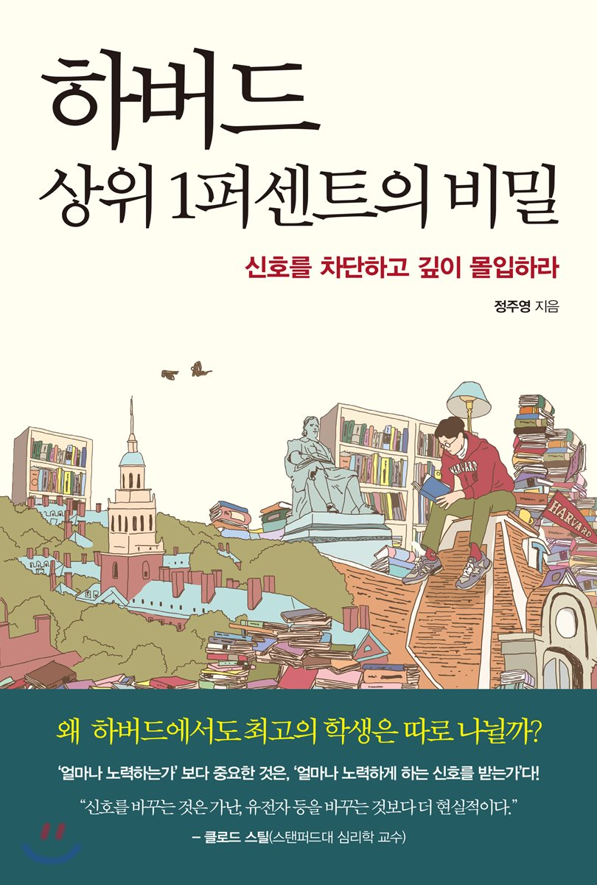

## 10억분의 1의 성공을 만드는 블랙 다이아몬드

> Black Diamond = Block(차단)xDeep(깊은 이해)

---

우리는 태어나서 의식이 생기고 난 순간부터 현재 이 시점까지 얼마나 많은 신호에 노출되고 있는가? '신호'는 크게 긍정적인 신호와 부정적인 신호로 나뉘어진다. 그리고 우리가 어릴적부터 계속 노출되어온 이 신호들은 마치 운명이 되어 우리 삶을 좌지우지 할 정도로 막강하고 무서운 것들이다.

어릴때 무심코 부모님이 한 칭찬이 한 아이의 인생을 바꾸기도 하고 일상에서 나누던 작은 대화가 삶의 큰 파장을 일으키기도 한다. 처음 이 책의 표지와 제목을 보았을때는 한국의 그저그런 하나의 자기계발서라고 생각하고 그냥 지나쳤다. 하지만 페이스북에서 하버드의 교육 커리큘럼을 지방 3류 대학에 이식하여 진행한 실험에 대한 글을 읽고 그 글의 출처가 이 책이라는 것을 알고 읽기 시작했다.

(지방 3류 대학에 하버드 대학의 커리큘럼을 그대로 이식하여 한학기를 진행했을때는 학생들이 공부를 따라가지 못하고 실패했다고 한다. 하지만 단 한과목만 가지고 똑같이 진행을 하니 하버드 학생들의 성취 결과보다 훨씬 뛰어난 성취를 보였다는 글이었다.)

이 책은 국내 서적이지만 상당히 많은 해외 여러 인물들, 연구들을 보여주는 책이다. 특히 야구 선수인 페드로이아, 고생물학자 존 호너, 지휘자 카라얀, 하버드 상위 1퍼센트 블랙 다이아몬드 등의 이야기는 정말 흥미롭고 재밌는 이야기들이다.

특히, 전통 교육에서 서열화를 우월감과 열등감이라는 연료의 관점에서 풀어쓴 건 정말 재밌는 관점이었다.
하버드대학의 마가렛 쉬 교수는 실험을 통해 상위권 학생들을 향한 성적에 대한 긍정적 신호(우월감)를 꺼버렸고 상위권 학생들이 더 이상 하위권이나 중위권 학생들과 경쟁하지 못하게 차단된 상황을 만들자 고난이도 문제를 풀 때 그들의 성적이 현저하게 떨어졌다. 그러나 다시 중위권 학생들과 경쟁을 치르게 하자 상위권 학생들의 성적은 눈에 띄게 올라갔다고 한다. 바로 중위권 학생들이 가지는 '열등감'이 상위권 학생들에게는 '우월감'을 느낄 수 있는 연료로 쓰인다는 점, 누군가의 낮은 위치와 열등감은 반대의 사람에게는 조용한 우월감과 성취감이 된다 라는 것이다. (이런 우월감이 은은할수록 더 효과가 크다고 한다.)

"자기 자신에 대한 생각은 상당 부분 타인의 판단"에서 온다. 그래서 우리는 그 잘못된 판단을 차단시키는 것이 굉장히 중요하다.

키가 작은 야구선수 페드로이아는 큰 스윙을 남발했다고 한다. 사람들은 모두 몸이 작다면 스윙을 낮추고 작게 하라고 조언하고 그를 그저 그런 선수라고 무시했다고 한다. 하지만 그는 다른 사람의 말을 쉽게 듣지 않았고 주눅도 들지 않았다. 동작이 크고 강한 스윙을 계속해서 연습했다. "그러던지 말던지 방망이와 공에만 집중하겠다." 이게 사람들에게 그가 한말이었다. (이외에도 책에는 그가 엄청나게 저평가 받고 있었다는 얘기가 나온다.)
2007년에 페드로이아가 아메리칸 신인왕이 되고 그 다음 해에는 MVP가 되었다는 얘기는 정말 흥미로운 이야기다.
선천적 난독증으로 대학을 7번 쫓겨난 존 호너와 하버드 대학 고생물학 박사 로버트 베커의 대조적인 일대기 또한 인상깊었다. (쥬라기 공원 자문을 맡은 존 호너가 베커 박사와 닮은 연구원을 티렉스에게 먹히게 하는 이야기는 킬포인트.)

이 책이 전하고자 하는 메시지는 간단하다.

- `천재란 없다`
- `주위의 부정적 신호를 차단하고 스스로에게 확신을 가지고 한 분야를 깊이 오랜시간 파고든다면 누구든 그 분야에서 가장 위대한 사람이 될 수 있다`

'내가 못한다, 나는 원래 못했다.' 같은 열등감을 가지고 있는 사람들은 고난도의 문제에 도전할때 작업기억력이 떨어진다고 한다. 서열화되는 시스템 자체가 개인의 학습 능력 자체를 저하시킨다는 말이다.

누군가를 가르치고 있거나 본인이 다시 무언가를 배우는데 과거의 경험(신호)이 본인을 괴롭히고 있다면 이 책을 읽어보길 바란다.
또한, 그냥 역경과 고난 속에서 실패자로 낙인 찍힌 인간들이 어떻게 한 시대를 대표하는 인물들이 되는지 인물들의 이야기가 궁금한 사람들에게도 추천한다. 이 책의 메시지와 별개로 이러한 스토리가 정말 흥미롭고 재밌다. 그것만으로 이 책은 읽을만한 가치가 있다.

우리가 이때까지 받았던 부정적 신호를 어떻게 바꿀 수 있을까?
**'자신의 가능성을 의심하는 외부 신호를 역으로 재평가하는 것만으로도 새로운 신호가 만들어질 수 있다'**고 한다.

- '나는 원래 ~를 못해'
- '난 이때까지 ~했기 때문에 할수없어'
- ..

같은 것들이 과연 정말 그런 것일까? 어릴때 누군가에 의해 나도 모르게 심어진게 아닐까? 스스로를 정의하고 있는 부정적 신호들을 의심하고 다시 재평가해보자.

그리고 지금도 나에게 부정적 신호를 주는 사람들이 있다면 그들의 말은 차단해버리고 그냥 내가 지금 해야하는 일에 깊게 몰입해보자. 그들의 말에 우리가 주눅들 필요는 없다.

### 책에서 다루었고 더 알아보고 싶었던 인상적인 인물들

    ⁃	야구선수 페드로이아
    ⁃	고생물학자 존 호너
    ⁃	지휘자 카라얀
    ⁃	미국의 제 56대 국무장관 키신저
    ⁃	화학자 마리 퀴리
    ⁃	도로왕 존 매캐덤
    ⁃	하버드 최연소 교수 앨런 더쇼비츠
