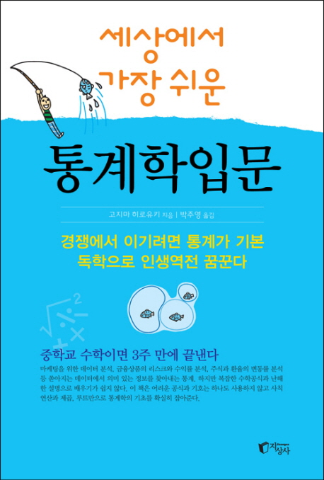
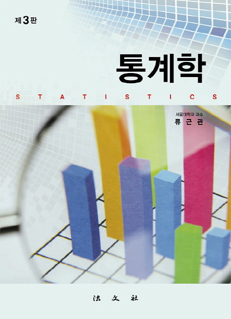
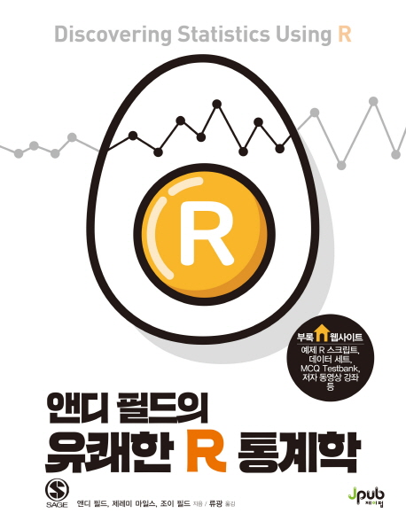
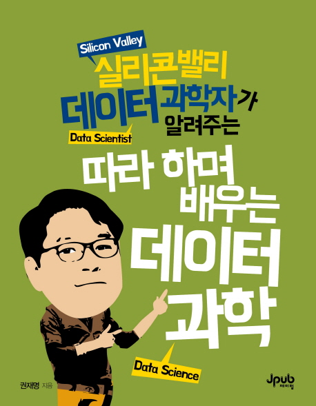
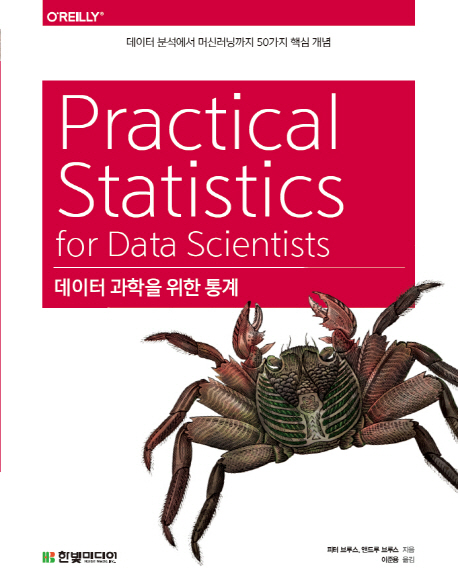
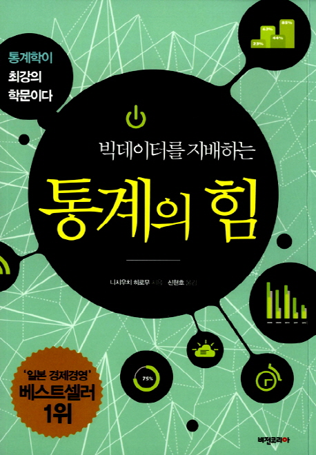
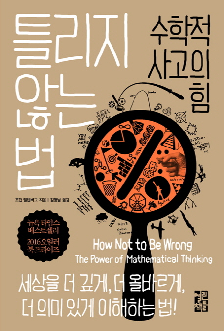

오프라인에서 통계학 강의도 하고 온라인에서 통계학 강의를 녹화하면서 배우시는 분들께 받은 첫 느낌은 통계학을 너무 어렵게 생각하고 있다는 것이었다. 아마 통계학의 첫 느낌이 고등학교때 확률 통계의 경우의 수 계산하는 기억에 머물러있는 분들이 대부분일 것인데, 사실 수리통계학까지 공부할 게 아니고 기본적인 통계학 개념과 교양 정도만 익힌다면 데이터 분석 공부나 관련 분야에 발을 들이기 훨씬 더 수월해진다. (기초 공부를 하고 심화로 넘어갈 수 있다.)

그러면 항상 따라오는 질문이 어떤 책을 보아야 하느냐 인데.. 사실 나도 보지 못한 너무 좋은 책과 교재들이 인터넷에 널려있지만 내가 조금이라도 보고 공부해본 책들을 위주로 간단하게 특징을 짚어보겠다. 어려운 척하기 좋아하는 해외 전공 서적보다는 최대한 쉽게 쓰여져있고 대부분 좋게 평가하고 왠만하면 한국 사람이 쓴 책을 위주로 추천해보겠다.

## 스터디 교재

### 난이도: 입문

### 이토록 쉬운 통계&R

표지부터 괴랄하기 짝이 없는 이 책은 이토록 쉬운 시리즈의 첫번째 책이며 그 주제가 통계이다. 저자는 패스트캠퍼스에서 강의를 하고 있는 걸로 알고 있고 가끔 광고도 보았던 것 같다. 이 책을 추천하는 이유는 일단 책 제목 그대로 쉽다. 정말 수학에 너무 겁을 먹고 있거나 데이터 분석이나 통계에 대해서 1도 모르겠다 싶으면 예시와 친절한 설명이 가득한 이 책을 추천한다.
말그대로 초보자를 대상으로 했기에 복잡한 설명이나 어려운 수식은 생략한다. 뒤에 R 부분을 제외하면 다른 교재에 비해 분량도 훨씬 적기 때문에 수포자들도 조금씩 읽다보면 어느새 통계가 무엇이고 데이터 분석을 어떻게 하는지 감을 잡을 수 있을 것이다. 조금이라도 통계를 알고 있다면 그다지 추천을 하고 싶지는 않다.

 

### 세상에서 가장 쉬운 통계학 입문

이토록 쉬운 통계책을 읽고 조금 더 필기도 해보고 문제도 풀어보고 싶은 분들을 위한 책이다. 하지만 제목에서도 나와있듯이 아주 쉽게 되어있고 이토록 쉬운 통계에서 깊게 설명하지 않는 검정이나 구간추정을 잘 설명하고 있다. 대학 교재가 부담스러운 분들은 꼭 추천한다.

 

### 통계학 류근관 저

표지를 봐도 딱 대학교재스럽게 생긴 책이다. 하지만 굉장히 쉽게 쓰여져있고 풀컬러에 전통 통계학에서 가장 실용적인 회귀 직선이 앞 부분에 나오는 등 당시에는 나름 파격적인 구성을 가진 교재이다. 서울대에서 수리통계학과가 아닌 경제학과 등의 상경 계열을 대상으로 쓰여져서 KMOOC나 서울대에서 제공하는 강의를 찾아보면 좀 오래되었지만 경제통계학이라는 좋은 강의도 찾을 수 있을 것이다. 교수님이 아주 친절하게 잘 설명해주시고 무료이니 책만 가지고 공부가 어려우신 분들은 강의 영상도 꼭 찾아보면 좋다.

이 책을 보면서 개인적인 감상은 이론보다 실제 예시를 최대한 활용하고 통계학을 최대한 활용할 수 있는 부분으로 연결시키기 위해 애썼다는 느낌이 많이 들었다.

---

 

### 난이도: 중급

### 앤디필드의 유쾌한 R 통계학

기초 통계학 책에서 다루지 않는 통계 기법들을 대부분 다룬다. 수식보다는 통계 기법 또는 모델의 기본적인 이론을 설명하고 교재에서 제공하는 다양한 데이터로 R 실습을 진행한다. 한창 공부를 하던 시절 책이 워낙 두꺼워서 분권화해서 공부를 했고 한글판도 나쁘지 않게 번역되었다. 내가 문과 계열 (사회, 심리, 행정 등) 대학원에서 통계를 활용하여 논문을 써야하는데 당장 수학 공부할 여유가 없다면 이 책 하나만 파는 것도 나쁘지 않다. 저자 앤디필드가 심리학, 아동 정신병리학 교수로 관련한 예제들을 다양한 기법으로 설명해주고 있다. R을 적극 활용하지만 머신러닝과는 반대로 설명 가능한 고급 통계 모형을 공부하고 그것을 R 코드로 활용까지 해보고 싶은 사람은 꼭 추천하는 교재이다.

기초 통계학 지식을 조금 가지고 있고 (입문 책 중 하나 이상 읽은 사람), Python 이나 R 을 조금이라도 맛본 사람에게 추천한다. 프로그래밍을 전혀 안했다면 R 실습이 쉽지 않을 것이다.

 

### 따라하며 배우는 데이터 과학

실리콘 밸리 데이터 과학자 권재명 박사님의 책이다. 사실 이 책은 머신러닝을 기본적으로 공부할 수 있는 책으로 그 수준이 입문이라고 할 수 있으나 기본적인 통계 지식을 바탕으로 뒤 내용들을 전개하기 때문에 이 책의 6장 정도에 나오는 내용은 쉽게 이해가 가능한 사람들에게만 추천한다. 머신러닝을 배우고 싶은 사람은 류근관 교수님 책 읽고 이 책을 보면서 실습해보면 좋을 것 같다. 1~5장은 환경 설정이나 기타 R 기초에 대한 부분이라서 본격적인 내용은 6장 이후이다. 통계 이론을 공부하고 실제로 통계 예측 분석을 활용해보고 싶은 분들이 보면 좋을 책이다.

 

### 데이터 과학을 위한 통계

통계학과 R 코딩을 어느정도 했거나 머신러닝, 데이터 과학을 공부하는데 통계가 어떻게 활용되는지 어떤 관점에서 통계를 공부해야하는지 궁금하다면 보면 좋다. 앞의 책들과 달리 차례대로 보는 튜토리얼 교재라기 보다는 내가 궁금했던 부분들을 그때그때 찾아서 보는 성격이 강한 교재이다.

---

 

## 교양 서적

바로 공부하기는 부담스러운 사람은 교양 수준의 책으로 먼저 접근을 해보는 것도 좋은 방법이다. 또는 위의 스터디 교재로 공부를 하면서 교양 서적들을 병행해서 읽으면 단순히 실무적인 스킬이나 이론 뿐만 아니라 실제 활용이나 사례를 통해서 다양한 인사이트를 얻을 수 있을 것이다.

### 빅데이터를 지배하는 통계의 힘 - 입문편

시리즈가 여러개 있는데, 기본편을 추천한다. 통계를 공부하기 위한 다양한 백그라운드나 빅데이터를 이해하기 위해서 왜 통계학인지, 뉴딜 정책, 나이팅게일, 우유-홍차 실험 등 통계학 역사의 여러 크고 작은 사건들과 이론이 탄생하게 된 이야기를 재밌고 쉽게 풀어써주는 책이다. 본격적으로 수학, 통계학을 공부할 여유가 없는 사람은 이 책을 읽는 것을 강력 추천한다.

 

### 틀리지 않는 법, 수학적 사고의 힘

내가 아는 한 데이터 분석을 조금 한다고 하는 분들 모두가 강력 추천하고 여러번 읽기를 하고 있는 그 책이다. 단순히 수학적 사고의 힘이라고 되어있지만 아무래도 실생활은 통계나 확률과 연관이 깊어서 생존자 편향, 선형 회귀, 확률, 추론 등의 어려운 통계 이론들을 다양한 사례를 들어서 재밌고 쉽게 설명하고 있다. 하지만 아예 통계를 모른다면 조금 난이도가 있을 수 있으니 약간 공부를 같이하면서 읽으면 훨씬 얻을게 많은 책이다. 꼭 통계나 수학이 아닌 일상 생활하는데서 수학적 사고의 유용성을 알려주는 부분도 있으니 꼭 읽어보자.

 

## 통계학 입문 책들을 추천하며

이외에도 조금 더 교양 서적들이나 통계학이나 데이터를 주제로 하는 다양한 책들이 있다. "새빨간 거짓말, 통계", "생각에 관한 생각", "모두 거짓말을 한다.", "팩트풀니스" 등등 내가 읽어본 것도 있고 읽어보고 싶은 책들도 있는데 관심이 있다면 찾아서 읽어보면 좋을 것 같다.

스터디 진행을 하면서 간략히 추천해주었던 책들을 포스팅으로 정리하니까 생각보다 시간이 오래걸렸다. 사실 공부를 하면 할수록 그냥 좋은 교재 하나 붙잡고 공부하는게 제일 좋은 것 같지만 입문을 하는 입장에서는 모든게 어려워보일 것이고 심지어 내가 정말 쉽다고 추천한 책도 그들한테는 어려울수도 있다. 그래도 포기하지 않고 책을 읽고 공부를 계속해나간다면 언젠가 정규 분포 기댓값을 수식으로 유도하거나 벡터 공간에서 선형 회귀 직선을 구하는 과정을 즐기고 있는 자신을 발견할 수도 있다. (아닐수도 있다..)

요즈음 툴이 너무 좋아져서 데이터 분석이나 데이터 과학을 하는데 있어서 그렇게까지 깊은 수학 이론이 필요없다는 것에는 동의하지만 그래도 기본은 알아야한다. 그리고 이 데이터가 넘쳐나는 시대에 관련 전공자나 커리어를 쌓는 사람이 아니더라도 통계는 필수 교양이 되어가고 있는 것 같다. 시간내서 꼭 공부해보시길.
