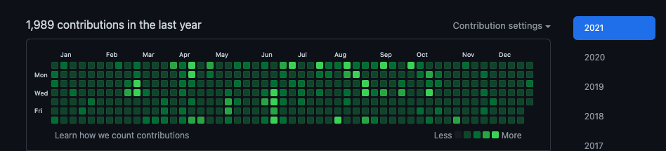

## 올해의 X

### 올해의 책: 싱크 어게인

협업, 공감과 이해, 리더십과 배움에 대한 책.
나랑 대화하는 사람, 일하는 사람, 리더할 것 없이 추천하고 싶은 책.

### 올해의 음악: Maneskin - I WANNA BE YOUR SLAVE

비쥬얼부터 뮤비까지 전부 당황스럽지만, 로잉 머신 땡길때 가장 많이 들은 곡이 아닐까 싶다.

### 올해의 영상: 아케인

듄도 재밌게 보았고, 최근에 스파이더맨도 재밌게 보았지만, 올해는 역시 넷플릭스 리그 오브 레전드 애니메이션 아케인이 최고였다. 한국어 성우도 너무 좋았고. 참고로 난 LoL을 한번도 못해봤고 앞으로도 할 생각은 없다. 그래도 아케인은 너무 좋았다.

### 올해의 프로그래밍 언어: Golang

1년간 golang을 했고, 즐겁게 코딩한 것 같다. 물론 지나고보면 golang에 대해서 정말 내가 제대로 이해하고 썼나 하는 의문점이 많이 들긴했다. 생각보다 깊이가 있는 언어이고 실제 Production 환경에서 그러한 깊이를 요구하는 챌린지가 꽤 있었다. django를 이제 더이상 안하게 된 건 좀 아쉬운 점.

## 들어가며

어떻게 된게, 이 블로그는 이전 글이 작년 회고, 그 다음 글이 또 1년 뒤 회고라니. 회고라고 쓰기도 민망해서 그냥 기록(..) 이라고 제목을 지어보았다.
(최근에 김창준님의 함께 자라기를 다시 읽고 있는데, 이건 회고가 아닌게 확실하다.)

사실 작년과 마찬가지로 올해도 예측불가능하게 흘러갔다. 무언가 커리어에 대해서는 더이상 어떠한 계획이 무의미하다는 것을 확실히 느끼고 있는 중이다.

작년 한 해가 대표에서 다시 개발자1이라면, 이번 1년을 요약해보자면,

“개발자1에서 다시 대표로 그리고 CTO가 되었다.” 정도로 요약할 수 있겠다.

작년 이 맘때쯤 얘기했듯이 좌절과 불행, 고난 속에서 많은 배움이 있었는데 올해는 그 배움의 가치를 적절하게 잘 발현할 수 있게 되었다. 물론 매일 한계를 맛보며 바닥을 치는 중이긴 하다. 깔끔하게 정리보다는 생각나는대로 기록해보련다.

### 1분기

데이터 강의로 SK와 계약하고 받은 돈을 시드로, 다시 풀타임 스타트업을 시작했고, 원래 같이 일하던 디자이너와 파트타임 클라이언트 개발자 친구와 일을 했다. 정확히 시작은 12월 중이었고 아마 올해 중에 가장 재밌었고 생산성이 높았고 신났던 기간이 아니었나 싶다. (내 사업이 제일 재밌다. 돈 걱정만 빼면.)

백엔드는 golang 이었고 gqlgen, echo 조합으로 쿠버네티스에 배포하여 프로덕션 운영까지 진행하였다. 개발 그 자체는 그 어느때보다 오히려 쉬웠고, 서비스 정책 설정, 기획의 어려움, 비지니스 모델에 대한 어려움 그리고 파트타임 클라 개발자 친구와 커뮤니케이션 이슈로 대표로, 매니저로 다시 다양한 챌린지에 놓이게 되었다.

### 2분기

모든 스타트업은 자금이 부족하지만, 2분기에 내가 자금이 부족한 건 아니었다. 그리고 개발 기간에 내가 약간의 시간을 투자해서 외적으로 자금을 수혈할 수 있는 방법 또한 있었고 데이터 강의도 SK 계약건에서 느낀바가 있어 데이터콜론도 다시 제대로 운영하고 싶었다. 그러다가 1,2분기에 주기적으로 연락을 주셨던 지금 회사 대표님에게 퇴근 이후 파트 타임 프로젝트를 제안받았다. 해당 프로젝트는 현재 회사에서 운영 중인 레거시 node 서버의 문제를 kafka로 해결하고 추후 데이터 파이프라인을 kafka 로 구성하는 것 이었다.

지금도 잘 모르지만, node 도 몰랐고 (프로덕션 개발을 안해봄), kafka는 아예 모르는 상태라서 망설이긴 했지만, 꿩도 먹고 알도 먹고 라고.. 공부도 하고 돈도 벌고 해볼만 하겠다 생각하고 시작을 했다. 그런데 그게.. 분명 파트타임 잡이었는데, 어느새 백엔드 파트 리드 및 일정 관리를 대표님과 CTO님이 물어보기 시작하면서 무언가 잘못되었다는 걸 느꼈고(..) CTO님이 CSO로 포지션 이동을 하면서 나에게 CTO 오퍼가 들어왔다.
고민을 잠깐 했지만 결국 결정을 했고, 입사(파트타임 -> 풀타임)한지 1주일만에 (정확히는 첫주 주말) 신규 시스템 빌드업을 위한 워크샵을 간다. (..)

(1분기에 진행하던 모든 일들은 사이드 프로젝트로 빠지게 되었다. 이 글을 쓰는 현재 시점에서는 회사 일때문에 Pending이 되었다.)

### 3분기

시리즈 B 이상 스타트업에서 CTO 경험은 처음이었지만, 에듀테크 즉, 교육 회사 특성상 개발자 규모가 5명 내외였기에 매니지먼트 자체가 어렵지는 않았고 프론트엔드 리드를 해줄수있는 7년차 분이 기존에 계셔서 프론트는 믿고 맡기고 백엔드 파트에 조금 집중할 수 있겠다고 판단했다.

스프린트를 세우고, 개발자 각자에게 가던 이슈를 슬랙 워크플로를 이용하여 채널을 단일화하고 layered architecture 도 적용되어 있지 않은 2000줄 짜리 단일 router 코드의 버그를 수정하고 잦은 서버 이슈로 self fetch 코드 제거 및 리팩토링, 최적화, 그리고 사실 그것보다 더 중요한 신규 도메인 아키텍처에 대한 디자인을 진행 하면서 바쁘게 시간을 보냈다.

그리고 현재 모든 스타트업들이 공감할 지옥의 채용 인터뷰 릴레이로 정신없이 하루하루를 보냈다. 티타임도 가지고, 팀 브랜딩한다고 블로그 쓰라고 내부 개발자 압박도 하고, 부트캠퍼들도 줄줄이 인터뷰하고 정신없이 시간이 흘러갔다. 사실 지금 와서 하는 말인데 채용에서 내가 했던 액션들은 크게 유효타가 없었던 것 같기도 하다. (나도 누군가의 말처럼 스타 개발자가 아닌 변방의 개발자다보니) 오히려 기존 팀원들이 예전에 일했거나 학교 선후배들에서 경력직들을 땡겨오기 시작하여 점점 팀이 갖추어지게 되었다.

그리고 회사가 PM/기획자가 따로 없이 (지금은 계시지만) 성장하다보니 UX팀과 커뮤니케이션 하며 PM/기획 역할도 병행했다.

대표님이 비전공자였지만 사업 초창기부터 직접 코딩을 해서 서비스를 운영한만큼 기술에 관심이 많아서 개발 사이드에 대한 관심과 존중이 있어서 회사가 외부에서 보여지는 것과 달리 기술조직을 서포트하고 빌드업해나가는데 수월했다. 또한 새로운 기술 스택 도입이나 이슈에 대해서는 집요하게 파고들어 나도 나이브하게 알고 있었던 여러 내용들이나 기술들을 깊이 있게 리서치하는 기회가 되었다. 물론 그 과정이 마냥 행복하지는 않았다.(..)

### 4분기

- 개발팀 5명 -> 16명 (2명 제외 모두 경력직 3,4년차 이상)
- nestjs 도입
- k8s 구축

정도의 일을 했지만 신규 시스템 빌드업이 생각 이상으로 모든 면에서 꽤 큰 작업이라 지금까지 일정 딜레이가 많이 되어있는 상태다. 거의 CRM/CMS/LMS/B2C 가 융합되어 한꺼번에 개발되는 프로젝트인데, 개발자들에게 익숙치 않는 교육 도메인에다가 시스템 구조도 에듀테크 특성상 독특한 부분도 있고 신규 개발자가 주마다 월마다 밀려들어오면서 온보딩이 제대로 이루어질때도 아닐때도 있어 계속 쉽지 않은 시간을 보냈던 것 같다. 12월이 되어서야 어느정도 팀이 갖추어진 것 같고 조금 더 팀 퍼포먼스를 끌어올리기 위해서는 (원래 기대했던만큼) 1~2달의 시간이 더 필요할 듯 싶다.

6개월 이상 회사에 있으면서 임직원은 그새 두배 이상 늘었고 모든 지표가 성장하는게 눈에 띄게 보이고 있어 신규 시스템 개발로 아직 비지니스 기여를 크게 하고 있지는 못하는 상황이라 조바심도 나고 있다. 여하튼 모든 회사의 기술조직은 그 회사의 비지니스 성과로 평가받는 거니까.

## 잘한 점

**Full Jandi**

신입도 아니고 취준생도 아니지만, 다시 개발을 하면서 열심히 커밋해보자고 하던게 1년동안 나름 잘지켜진 것 처럼 보인다. (작년 12월부터 쭉) 후반부 상당수는 내 커밋보다는 코드 리뷰가 대부분이긴 한다. 그래도 바쁜 와중에 코드를 계속 썼다는 것에 의의를.

**독서/스터디**

싱크어게인, 크래프톤 웨이부터 인류애를 찾아주는 휴먼카인드, 최강의 조직 등등 그래도 비개발 서적으로 분류되는 책을 20여권은 본 것 같고, 함께 자라기, 클린 아키텍처를 비롯 DDD, 함수형 사고, 이펙티브 타입스크립트 등의 책, 스터디도 진행했다. 여튼 계속 읽고 생각하고 적용해보는게 나에게는 정말 가치가 있는 활동들이다. 사실 이것말고 잘하는게 없다.
허접한 생각이라도 기록하고 공유를 많이 못한건 아쉽다.

**사내 통계 세미나**

4분기 2달 정도의 시간을 들여서 사내 비전공자 대상 통계/데이터 분석 강의를 진행했다. 1년간 강의를 쉬다보니 강의력이 많이 무뎌져 있었지만, 다시 내용을 전달하고 정리하는 과정에서 나름대로 다시 배우는 것들이 있었다. 항상 가르치는 사람이 가장 많이 배운다.
근데 8주동안 매주 2시간씩 강의도 하고 과제도 내주고 관리했는데 내가 추천한 권정민님의 “숫자 유감”에 참여 인원들이 더 많이 배우는 것 같더라.
역시 뭐든지 전문가에게 가세요. 그리고 만화책이라 오히려 좋아.

**Functional 그리고 DDD**

함수형으로 코드를 짜냐? 아니다. 클로저, 리스크립트 같은 함수형 기술 스택으로 유명한 그린랩스에서 말했듯 난 절차 피클러인 것 같다. 그래도 js, kotlin, swift 언어로 함수형 코드를 많이 연습 중이다. 아니 제대로 함수형을 하려면 Haskell 이나 클로저를 하던가 하다못해 Scala 라도 해야하지 않냐고 할 수 있겠다. 물론 맞는 말이다. 근데 아직 거기까진 여유가 안된다. 내공이 부족한듯. 괜히 애매하게 함수형에 맛들렸다가 golang generic 만 기다리는 부작용만 생겼다. 그래도 재밌다. 나름 실용적인 언어로 하고 있어서 실 개발에 유용하기도 하고. 재밌으면 하는 거지 뭐.

(JS 하시는 분들은 인프런 유인동님의 함수형 프로그래밍 강의 꼭 보자. 두번보자.)

DDD를 잘아냐? 잘 모른다. 그런데 에릭 에반스의 DDD 책 말고도 DDD Start, 도메인 주도 설계 철저 입문 등의 책을 다시 들춰보면서 배우는 바가 있었다. 자바라면 경련을 일으키던 내가 spring boot 도 하고 있다. (아니 사실 CA/DDD 관련해서는 자바 자료가 제일, 아니 유일하다. 국내한정. ~~자바공화국~~ )

에릭 에반스 책을 예전 소프트웨어 마에스트로 시절에 읽은 기억이 있다. 그때 나는 무엇을 읽은 것일까?

회사 신규 시스템이 엔터프라이급이다보니 아키텍처 고민이 많았는데 DDD로 어느정도 해소가 되었다. (그런데 이럴거면 nestjs 보단 그냥 spring boot 가 나을 것 같다. 개발자 채용도 훨씬 쉽고.)

여러 자료를 찾다가 결국 코드 구조는 29cm의 이희창님의 패캠 The Red 강의가 도움이 많이 되었다. MSA 강의라고 되어있어서 구매했었는데 오히려 DDD를 제대로 리뷰하고 좋은 코드 구조를 참고할 수 있어서 좋았다.

**투자**
캐시가 좀 생겨서 국내 게임회사들과 나스닥 몇개, 코인 투자를 했는데 나름 재미 좀 봤다. 물론 엄청 큰 돈은 아니지만. 덕분에 공부도 많이 했고. (슈카월드짱) 특히 연초에 샀던 DataDog 은 주식이 미쳐버리게 뛰었다. 더 샀어야 했다. 다시 생각해보니 못한 점인듯. (라고 할때 살걸)

작년 이맘때쯤 코인 사지 않아서 후회했는데 새해에는 행복회로 돌려본다.

## 못한 점

**운동**

코로나와 회사 출근이 겹쳐져서 2분기 이후로는 헬스장을 거의 못갔다. 지난 3년을 무게충이 되어서 스트렝쓰 한다고 식단관리도 안했었는데, 웨이트도 못하고 식단관리도 안되어 몸이 더 불었다. 이사를 하면서 Concept2 로잉머신을 샀는데 초반에 불타오르는 로잉에 대한 사랑이 금새 사그러들고 중간에 잠깐 머신과 권태기를 거치고 최근에야 다시 안정적인 관계를 이어나가고 있다. 인터벌을 타면 190 BPM이 넘을 정도로 빡세게 타는데, 이게 너무 부담스러웠다. 지금은 느려도 꾸준히 오래타는 걸 목표로 하니 매일 꾸준히 다시 타는 중이다.

어쨋든 웨이트 못한 건 너무 아쉽다.

그러고보니 잠깐 크로스핏 박스를 나간 적이 있었는데 계속 코로나 단계가 올라가서 꾸준하지 못했다.

**사이드? 프로젝트**

어쩌다보니 본업과 부업이 바뀌어버렸다. 그래도 나름 균형점을 찾아서 잘하고 있었다고 생각했는데, 역시 회사 일이 메인이 되고 바쁘게 돌아가다보니 밸런스가 무너졌다.사실 개발도 개발인데, 기획이 참 어렵다. 사업 운영은 더 어렵고. 아니 개발도 어렵다. 다 어렵다.

# 나가며

작년보다는 조금 중간 관리자의 면모를 갖춘것 같았고, 높아져만 가는 연봉 테이블의 개발자들과 존중과 압박이라는 묘한 줄다리기 과정에서 아래로 가는 리더십, 위로 가는 리더십 모두 여러번 시험 당하고 바닥도 치고 좌절도 했지만 나름 현재 팀을 보면 내 스스로 다시 한번 많이 배웠다고 생각한다. 물론 항상 조금 더 잘할 수 있었을 건데 라는 아쉬움이 남고.

중간에 한달 정도는 멍하니 회사 출근-퇴근-잠-출근-퇴근-잠만 반복했던 기간이 있었던 것 같다. 운동도 안하고 책도 안보고 유튜브만 보다가 늦게 잠들고. 지금와서 생각해보면 번아웃이었나 싶기도 한데.. 항상 날 움직이는 건 위기 의식이었다. 이러다가 그냥 그런 사람이 되겠다 싶은. 다시 생각해보니 번아웃보다는 뭐랄까 다시 월급 받고 뜨신 밥 먹으니까 생긴 안도감? 안정감인가. 정글에서 자라온 나같은 정글러(?)에게는 항상 위기 의식이 필요하다.

2011년에 창업/코딩 두 단어만 생각하고 코딩은 Rails Tutorial로 창업은 팟캐스트로 배우면서 일 시작했던게 벌써 10년이 되었다. 남들 학교다닐때 일 시작해서 올해로 만 10년, 이제 내년에는 11년차이다. 남들처럼 개발 커리어만 있는 것도 아니고 워낙 딴짓거리를 많이해서 지나간 시간이 참 재밌기도 하고 후회도 되고 복잡한 감정이다.

내가 처음 일을 시작했을때 10년 뒤의 나의 모습은 지금 이 모습이 아니긴 했다. 그 모든 시간을 실패했다고 하기는 어렵고 남들볼때는 나름 성과를 거둔 것 처럼도 보인다.
그런데 아직 이루지 못한 것들이 분명있다.

위기 의식 가지고 조금 더 앞으로 나아가보자.

올해도 고생했다. 새해도 화이팅!
