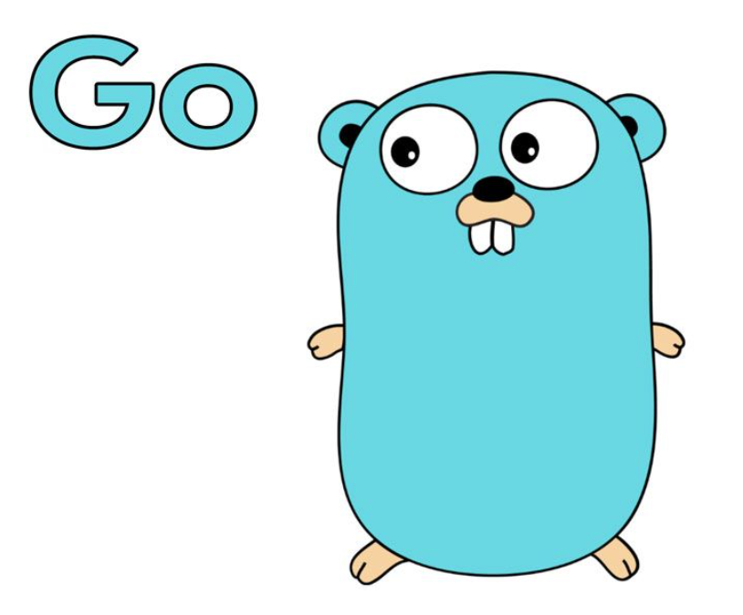
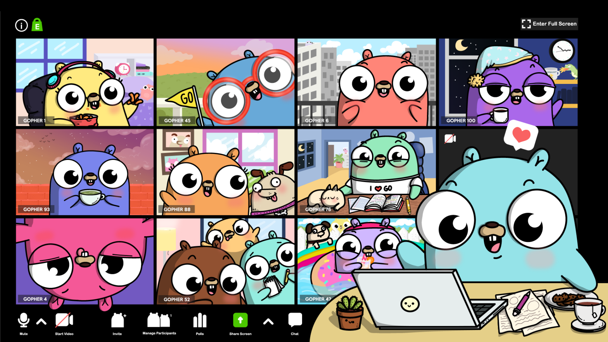

# 20년 12월 7일 ~ 12월 13일

## 들어가며
- This Week I Learned 시작
	- 같이 개발하는 친구의 블로그 제안으로 약간의 강제성을 띄우고 매주 글을 써보기로 했다.
	- I Learned 이긴 한데 그냥 한 주의 내 이야기도 남길려고 한다.
- 퇴사
	- 회사가 잠깐 힘들어서 6개월간 다닌 회사를 이번달을 마지막으로 그만두게 되었다. “스타트업 대표 7년차의 6개월 직원 일기” 같은 썰을 나중에 가볍게 써볼까 한다. 아쉬운 점도 많지만 어쨋든 많이 배운 기간이었다.
- M1 맥북 주문 취소
	- 13인치 M1 애플 노트북을 예약 구매를 했었으나 취소를 했다. 일단 당장 개발을 하는데 있어서 Docker 나 기타 개발 환경, 개발 도구들의 호환성 문제도 있고 해서 굉장히 성능이 좋다는 말에 혹해서 질렀지만, 취소하고 그냥 19년 형 16인치 맥북 프로를 주문했다.
	- M2가 나오고 내년 하반기쯤 호환성 부분에서 전체적으로 지원되는 분위기가 형성되면 갈아타는게 안전할 것 같다. 
	- 아쉽긴 하다(..)

## 개발
- Golang
	- 기존에 Django로 작업하던 것들을 버리고 Golang 기반으로 넘어가기로 결정했다.  사실 원래는 Django 로 어플리케이션 서버를 구성하고 분산 처리가 필요한 연산이 있어 gRPC나 REST로 go 서버와 통신을 하는 방법을 고민했었다. 근데 아직 프로젝트 초반이고 서비스 운영도 하지 않은 상태에서 언어를 통일하는 방향, 그리고 무엇보다 새로운 것을 하고 싶다는 나의 내면의 욕구를 이기지 못했다. (..)
	- 도움이 되었던 링크
		- [당근마켓의 고언어 도입기, 그리고 활용법](https://www.youtube.com/watch?v=mLIthm96u2Q)
			- 발표를 잘하신다. 레일즈, 장고 등의 서버 운영 경험이 있는 사람들이라면 특히 공감이 많이 될 것 같다.
		- [Tucker 의 GoLang 프로그래밍]([YouTube]https://www.youtube.com/channel/UCZp_ftx6UB_32VfVmlS3o_A)
			- 게임 프로그래머라고 하시는데, 프로그래밍 강의에 트랜지스터부터 설명하는 등 깊이가 있다. 강의가 워낙 길어서 다 보지는 않고 중간중간에 필요한 부분만 살짝 보았다.
		- [디스커버리 Go 언어  - YES24](http://www.yes24.com/Product/Goods/24759320)
			- 제일 처음 본 책. 물론 다보지는 못했다. 그래도 프로그래밍을 해본 사람이 Go 에 대해서 알아가는데 나름 깊이있게 다룬 책인 것 같다.
- Golang 프로젝트 해본 것
	- Dame24
		- Yes <-> No -> Dame (..) 에서 나온 스크래핑 봇이다. 가볍게 프로젝트를 해보고 싶었는데 gocolly 라는 크롤링 라이브러리가 워낙 좋아서 몇줄 안짜고 내가 원하는 결과를 얻었다. 가볍게 Echo를 붙여서 ISBN 코드로 책 정보를 가져오는 봇이다. 
		- 지금은 단순히 특정 페이지에 대한 스크래핑만 하는데, 다양한 데이터를 긁어올 요구사항이 있어 원래 라이브러리 목적대로 크롤링 봇으로 발전시켜볼 예정이다.
	- rbengine
		- 지금 서비스의 핵심 엔진(..)
		- 열심히 TDD 하면서 짜보고 있다. 확실히 Go는 코드 구현에 있어서 많은 선택지가 없다보니 조금 더 명료하고 직관적으로 코드를 짜는 것 같다.
		- Ruby에서 Python/JS 그리고 Go로 오면서 참 나도 많이 바뀌었다는 것을 느낀다. 
	- Web 
- Golang Web
	- [Go My Way #1 - 웹 프레임워크 - Jaehue’s](https://jaehue.github.io/post/go-my-way-1-webframework/)
	- [Golang ORM, 무엇이 좋을까? · Billo Park](https://blog.billo.io/devposts/go_orm_recommandation/)
		- Golang을 다루는 고수분들이 많아서 그런지 한글로 정리된 글들이 꽤 고퀄리티의 글들이 많은 것 같다.
		- Go에서는 Ruby 하면 Rails, Python 하면 Django 이렇게 정해진 게 없다보니 처음 스택을 정하는데 고민이 많이 되었다. 심지어 Go의 ORM도 굉장히 부족한 환경이라 다양한 글을 봤는데 기술 스택을 정하는데 큰 도움이 된 글이 저 두개의 글이다.
	- Echo + gORM + gqlgen 선택
		- 웹프레임워크는 Echo를 선택했고 ORM 으로는 gORM 그리고 현재 클라이언트의 Graphql 인터페이스를 지원하기 위해 gqlgen 선택해서 진행
		- 초기 도커 세팅부터 DB 마이그레이션까지 삽질을 꽤 했다.
		- 	제대로 진행해보고 후기를 남기겠다.

## 회고
- 좋았던 점
	- 글을 쓰기 시작한 점
	- Golang을 본격적으로 시작한 점
	- 퇴사(?)
- 아쉬운 점
	- Golang Web 하면서 삽질을 많이 해서 이번주 목표했던 부분까지 개발하지는 못했다.
	- 코로나 2.5단계가 되면서 헬스장을 가지 못해 운동을 못하고 있다.
- 개선할 점
	- 결국 돌아보면 지름길은 없더라, 확실히 풀프레임웤에 비해 좀 답답한 면이 있지만 한땀한땀 코딩해가면서 배우는 재미, 느끼는 재미가 있다. 나아가자.
	- 외부 환경에 흔들리지 말고 내가 해야할 일에 집중하자.

## 여담
- Gopher 이야기
	- Golang을 다루다보면 Golang을 대표하는 아주 귀여운(?) 마스코트 Gopher를 만날 수 있다.
	
	 

	
	
	

	 

	- 너무 귀여운데.. 다른 사람들 반응이 심상치 않다. 

	 
	 

	

	 
	
	- 취존..ㅠㅠ

