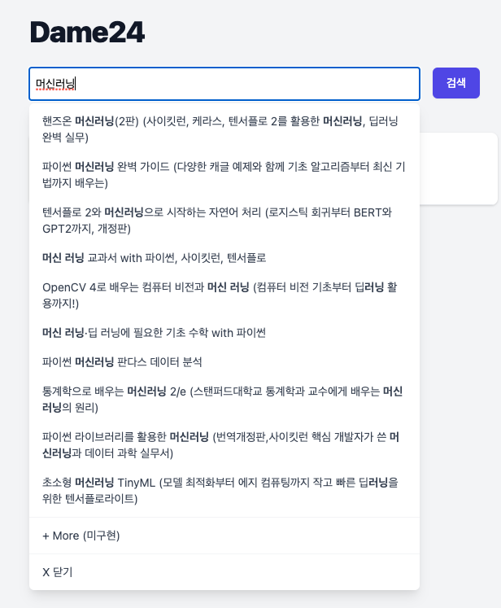
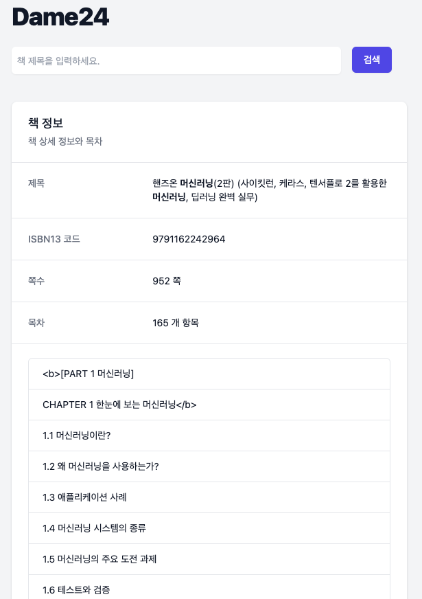

들어가며
- 이번 주는 집중을 했던 한주 


## 개발

### Dame24

- 지난주 생성했던 것을 1차 매듭을 지어보았다. 서비스 요구사항은 스터디 계획을 만들때 자동으로 책의 목차와 쪽수를 가져와서 나눠줘야하는데 내부 테스트용 웹 클라이언트를 하나 만들어보기로 했다.
- 지금 공개되어있는 Open API 중 유일하게 쓸만한게 Naver 책 검색 API라서 지난 주에 Go 서버를 간단히 만진 것과 1차 프로토타입을 만들어보았다.
- 사용한 것
	- Back
		- Golang
			- Go 코딩은 즐겁다.
			- 사실 이번에 작업할때는 문자열 처리 함수를 좀 활용한 것 말고는 Go 자체 코딩은 별로 없다.
			- 대부분 서버며 라우팅이며 스크래핑이며 라이브러리가 해준다.
		- Echo
			- 나는 처음부터 Echo 를 사용했는데, 최근에 예제를 보면서 net/http, gorilla/mux 로 하나하나 붙여가며 작업해본 적이 있어 Echo가 참 좋다. 
			- 다만, 공식 가이드 문서가 조금 마음에 안든다.
			
```go
func postContents(c echo.Context) (err error) {
    b := new(model.Book)

    if err = c.Bind(b); err != nil {
        return
    }
//... 생략
```


- 재밌는 건 위 handler 코드인데 post로 전송한 Body를 struct 만 잘 정의해주면 c.Bind(b) 에서 바로 매핑을 시켜준다. 
- 물론, 파싱해온 결과를 리턴할때는 아래와 같이 디코딩해주었다.


```go
//...
json.NewDecoder(res.Body).Decode(&sr)
//...
```


-  gocolly (goquery 포함)
    - 이 전에도 말했듯 단순 스크래핑에 쓰기엔 좀 과하다고 볼 수도 있다. 다만, 크롤러도 만들어야하기에 사용에 익숙해지면 좋을듯하다.
    - Async(true) 옵션 하나 만으로 병렬처리가 가능한 마법을 느낄 수 있다. 
- Front
    - create-react-app + Typescript
        - 기본. 뭐 말이 필요한가..
        - App.tsx 에 다 때려박고 api나 interface 정도만 분리하고 BookCard 컴포넌트가 길어서 분리했다.
    - react-query
        - 이번에 삽질한 의외의 복병…
        - apollo 를 워낙 잘 쓰고 있어서 api end point 가 두개밖에 안되는데 그냥 써보고 싶어서 적용해보았다.
        - typescript 쓰면서 항상 Type 할당이나 반환값에 대해 이해를 잘못해서 해메는 경우가 많았다. 특히 react-query 는 대부분 useQuery 에 대한 기초 예제는 많은데 필요할때 요청하는 useMutation에 대한 예제가 많이 안보였다. 물론 공식문서보고 해결했으나 Typescript는 하면서 조금 삽질을 한 것 같다.
        - 간단히 적자면, axios instance 함수 리턴 data에 타입을 정의해주고 useMutation으로 해당 instance 리턴 함수를 실행하는 커스텀 훅을 만들어주었다. 메인에서 정의하면, mutate() 함수로 요청을 보낼 수 있고 해당 객체의 data에 저장이 되는 형태이다.

```typescript
// 커스텀 훅. 첫번째 인자는 키값이고 react-query 캐싱을 이용할때 쓰는 것 같다.
export function useSearchBook() {
  return useMutation("searchBook", async (title: string) => {
    return searchBookByName(title);
  });
}

// App.tsx
//..
const searchMutation = useSearchBook();

//..

const onSubmit = async ({ title }: FormData) => {
  searchInputRef.current?.focus();
  await searchMutation.mutate(title);
};

//..

searchMutation.isLoading // 로딩 상태 true/false

//..

searchMutation.data

//
```
- SWR 에 비해 코드를 잘 못찾겠더라.
-  tailwindcss + tailwindui
    - 나의 CSS에 평안을 찾아준 갓윈드css.. UI 라이브러리도 올해 초에 얼리로 구매해놓고 잘 갖다 쓴다.
    - 이번에 v2.0 이 나왔는데 조금 바뀐게 있어서 스타일링에 삽질을 조금했다.
- Deploy
    - 내부 테스트용이다 보니 제일 빠르게 할 수 있는 방법으로 배포를 했다.
    - go 서버는 간만에 Heroku 를 사용해보았고 react는 언제나 그랬듯이 netlify
    - asset 문제인지 초기 로딩이 좀 늦다. 뭐 어차피 프로덕션용은 아니니.
- 결과물

<br />



<br />



## 프로젝트
- 스택
	- Go + Echo + gqlgen 
	- React + Typescript + apollo
- 주중/주말 내내 매달렸는데 그래도 그럴듯한 아웃풋이 나왔다.
- 관련 스택에 대해서는 천천히 후기를 써볼까 한다. 일단 프로덕션 릴리즈부터..

## 회고
- 좋았던 점
	- 한 주를 일에 온전히 집중할 수 있었다.
- 아쉬운 점
	- 코로나가 심해짐에 따라 운동도 못하고 업무 때문에 독서나 다른 걸 챙기지 못하고 있다.
	- 원래 달리기를 하려고 했는데 러닝 시작한 이틀째 되는날 무릎통증이 심해서 보니 거위발건염이라는 것이 나에게 왔더라. 달리지 못해 아쉽다.
- 개선할 점
	- 루틴을 다시 짜보고 급하지 않지만 꾸준히 해야할 일들을 챙기자.

## 여담
- 사실 되게 많은 Input 그리고 그에 따른 Output 도 있었는데 시간이 좀 지났고 아웃풋에 급하다보니 좀 제대로 정리를 못했다.  꾸준히 쓰려면 평소에 작성을 하고 좀 포맷을 정해야겠다.
