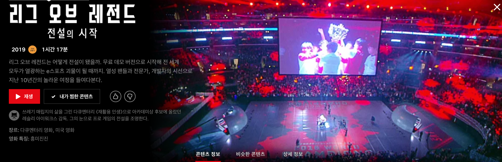

주말에 쉬면서 다큐멘터리 한편을 보았다. 넷플릭스에는 볼만한 다큐멘터리가 많은데 특히 내가 강력 추천하는 다큐멘터리는 스포츠 약물 고발 다큐멘터리 '이카로스', 인공지능 시대의 시작을 알린 '알파고', 그리고 다큐멘터리이지만 거의 스포츠 드라마에 가까운 'F1, 분노의 질주' 등이다. '인사이드 빌게이츠'는 재미면에서는 그렇게 좋진 못했지만 빌게이츠에게 관심있다면 추천한다.

이번에 본건 그 유명한 롤(LOL), 리그 오브 레전드라는 게임의 탄생과 지금 현재에 이르기까지의 이야기를 다룬 다큐멘터리다.

---

개인적으로 나는 롤을 해본적이 없고, 한창 소프트웨어 마에스트로 연수 센터에서 공부하고 프로젝트 개발에 힘쓰고 있을 시절에 다른 개발자 친구들이 삼삼오오 모여서 롤을 밤늦게까지 하는 풍경을 자주 보았다. 그리고 소위 '롤드컵'하는 시즌만 되면 휴게실에 모두 모여서 시청하는 모습을 본 기억이 있다.
오히려 이렇게 팀을 맺어 한 전장에서 PVP를 하는 AOS 류의 게임은 모바일로 '베인 글로리'로 접했는데 이게 당시에는 롤의 경험을 최대한 모바일에 최적화한 게임이라고 들었다. 그리고 최근에는 훨씬 캐쥬얼화된 요즈음 Z세대들에게 최고의 인기를 누리는 '브롤 스타즈'를 즐겨하고 있으니 아예 이런류의 게임을 모른다고 할 수는 없다.

롤의 시작은 스타크래프트, 디아블로, WOW로 유명한 블리자드의 워크래프트 유즈맵으로 시작되었다는 것을 익히 알고 있었는데 그게 어떻게 새로운 하나의 게임으로 개발되어 지금과 같은 폭발적인 인기를 얻게 되는지 그 과정을 여기서 보여준다.

피, 땀, 픽셀에서도 읽었듯이 게임 개발하는 과정(또는 제품을 개발하는 과정)은 정말 지난하고 고난한 과정인 것 같다. 3년간 수익 하나 없이 개발에 몰두하고 과감하게 Free to Play로 게임을 공개하고 (흥미롭게도 우리나라 온라인 게임들은 오래전부터 Free to Play였는데 미국에서는 롤이 거의 Free to Play 게임들 중 첫 세대와 다름없고 미국에서 처음 Free to Play를 한 게임이 넥슨의 메이플 스토리 북미 서버 버전) 캐릭터의 능력치를 파는게 아닌 스킨과 같은 게임의 밸런스에 영향을 미치지 않는 아이템을 파는 등 아마존의 책을 읽으면서 느꼈던 정말 유저를 위한게 무엇일까, 게이머들을 위한게 무엇인가에 치열하게 고민하고 실행하는 모습에서 또 한번 많은 것을 느끼고 배우게 된 것 같다.
특히, 유통사를 통해서 유럽에 출시하여 본인들의 운영 방향과 반대되는 방향으로 운영되는 것을 보고 유저들의 쌓인 불만을 해결하고자 직접 유럽에 지사를 세우고 서버를 이전하려고 하드웨어를 옮기는 날 화산이 폭발하여 항공이 마비되어 아프리카로 경로를 수정하여 옮기는 이야기는 그들의 유저, 게이머 중심적인 태도와 이 게임에 대한 열정을 바로 느낄 수 있는 이야기였다.

두번째로 중요하게 다루는 내용은 팀 게임이고 PVP인 롤의 특성을 살려 이것을 스포츠화하기 위해 어떠한 노력을 했는지 어떤 시도를 했는지 나오는데 정말 재밌는 건 이 '게임'이 미국이라는 사회 내에서도 '스포츠'로 불리기까지 제도권 내의 보수적인 기성세대들에 의해 얼마나 조롱당하고 공격당하는지도 과감없이 보여준다. 기성 세대들의 관점에서 게임이 가지는 속성이 꼭 우리나라에서만 보수적인 건 아니라는 것이다.

그리고 롤의 성공에 기여한 우리나라, 한국이 굉장히 큰 비중으로 나온다. 인구밀집도가 굉장히 높고 세계에서 제일 빠른 초고속 인터넷이 설치되어 있고 이미 20년전부터 e스포츠가 있었던 국가라는 점을 강조하면서 진정성 있게 우리나라 게이머들을 감동시키고 3개월만에 국내에서 최고의 게임으로 자리잡는 모습, 그리고 마이클 조던에 비유하는 롤 최고의 선수 'FAKER'(프로게이머 이상혁)까지 비중있게 다룬다. (잠깐 지나가는 장면에 내가 5년전에 자주 갔던 PC방이 나와서 깜짝 놀랐다..)

단순히 성공 스토리만 다루지 않고 롤이 가진 커뮤니티의 힘 그리고 트위치, 유튜브 등의 게임 스트리밍 문화, 그리고 이러한 경쟁 게임이 가진 피로감과 중독성 같은 이면도 짧지만 다루기도 한다. 그래도 다큐멘터리는 이러저러한 문제가 있고 더 노력해야겠지만 롤은 최근 10년 내에 최고로 성공한 게임이자 거대한 커뮤니티이며 새로운 커넥션을 만들고 전세계에서 흥행하는 스포츠 중 하나라는 사실을 얘기해주며 마무리한다.

작년 '님폰없'과 홍콩선수 징계 사건으로 민심이 추락한 블리자드에 대비되는 모습으로 '라이엇 게임즈'는 행사를 하며 신작들을 발표하고 게이머들을 위한게 무엇인지 고민하는 모습을 보여주며 더 좋은 평가를 받고 있다.
블리자드의 한 게임의 유즈맵 정도에서 나온 게임 장르로 시작하여 10년이 지나며 이제는 전혀 다른 평가를 받게 된 두 회사의 모습을 보며 역시 진정으로 유저(고객)를 생각하는 것만이 시장 경쟁에서 승리할 수 있는 유일한 요소라는 것을 다시금 깨닫게 된다.

특히, 중간에 두번째 공식 롤 대회 결승전에서 대회 중 인터넷이 끊겨 망한 상황에서 라이엇 게임즈 창립자 중 한명인 브렌드 벡이 나서서 상황을 수습하는 모습은 굉장히 인상적인 장면이었다. (티켓 전액 환불, 롤 게임 포인트 25달러 지급, 상품을 무료로 뿌리자 화가 나 있고 실망한 관중들이 한순간에 'LOL'을 외치는 광팬으로 변하는 장면이었다.)

게임의 성공 요소는 당연히 첫번째는 재미이다. 그리고 두번째는 네트워크 효과이다. 롤의 초기에 85%가 친구 추천으로 게임에 입문했다고 한다. 또한 친구가 하니까 나도 계속 하게 되는 것이다. 마지막은 진정으로 게이머들을 생각하는 개발사의 운영, 그러한 태도이다.

단순히 게임에서 뿐만 아니라 서비스를 만들고 기획하고 운영하는 입장에서도 배울게 많았던 다큐멘터리였다. (그렇다고 내가 롤을 하지는 않겠지만..)
롤을 좋아하는 사람에게는 최고의 다큐멘터리가 될 것 같고, 롤을 하지는 않았어도 그것을 이해하고 성공하는 서비스의 교훈을 얻고 싶은 사람들은 한번쯤 보면 좋을 것 같다.

개인적으로 앞으로 나올 '라이엇 게임즈'의 다른 게임들은 롤만큼 성공할 수 있을지, 아니면 결국 롤이 최고의 게임으로 남을지 기대가 된다.

> "골프 경기를 보는 사람은 이해해요. 근데 컴퓨터 게임 하는 사람은 왜 보는지 모르겠어요."
> "내 아내는 골프 경기 보는 것도 이해 못 해요. 골프를 안치거든요. 당신이 게임을 안하면 재미없게 느껴지죠"
